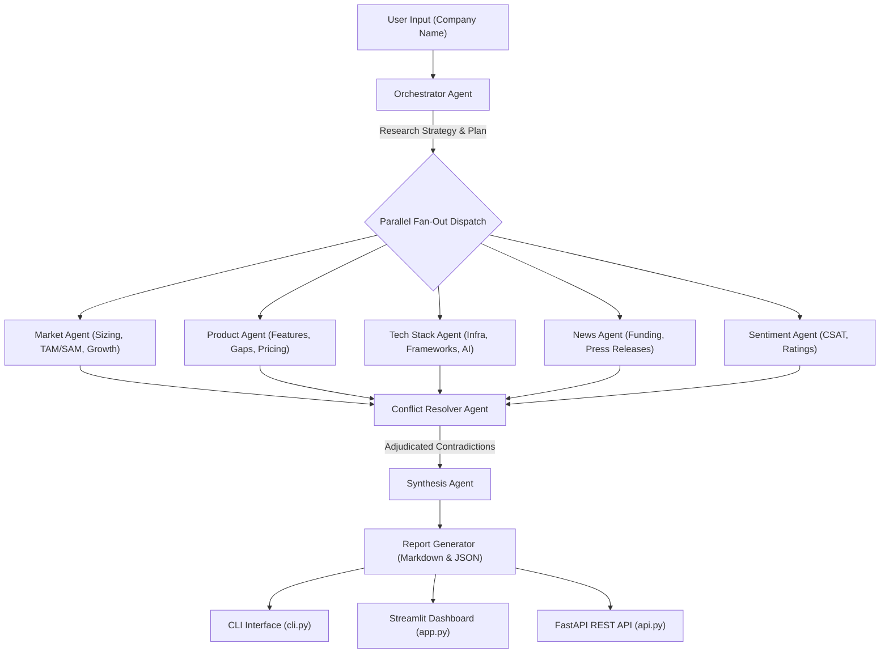
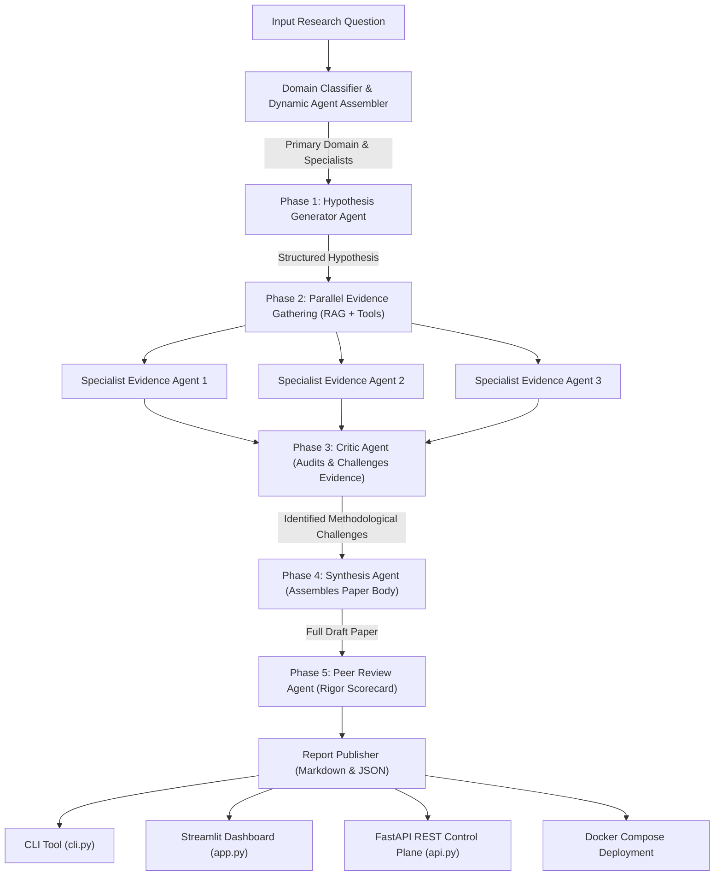

CALDER AGENTIC AI ENGINEERING WEEK 5 REPORT

1. WEEK 5 CONCEPTS

Multi-Agent Architectures: Multi-agent architectures define how multiple AI agents coordinate, communicate, and solve complex problems together.

Types of Multi-Agent Architectures:
- Orchestrator-Worker: A central orchestrator decomposes a task and delegates subtasks to specialized workers.
- Supervisor Pattern: A supervisor agent monitors worker execution, detects failures or low confidence, and dynamically reroutes tasks.
- Peer-to-Peer Networks: Equal agents communicate directly through message passing or shared state without a central controller.
- Hierarchical Teams: Multi-layered control structure (Executive -> Team Leads -> Workers) providing context isolation at each level.

Typed Message Passing: Using Pydantic schemas to define explicit message contracts between agents instead of raw strings or dicts.

Why Typed Messages Matter:
- Schema validation at message boundaries
- Type safety and IDE autocomplete
- Rejection of malformed payloads before agent execution
- Deterministic tracing and auditability

Pydantic Message Schemas:
i- TaskRequest
Fields: task_id, description, instructions, priority, requester, timestamp.

ii- TaskResult
Fields: task_id, result, confidence, agent_name, execution_time, timestamp.

iii- ErrorReport
Fields: task_id, error_message, error_type, agent_name, timestamp.

iv- Handoff
Fields: from_agent, to_agent, context, task_id, priority, timestamp.

Message Bus: An in-memory routing backbone that manages agent registrations, validates typed Pydantic payloads, and dispatches messages to registered handlers.

Supervisor Pattern & Failure Recovery: A central agent receives a task, decomposes it into subtasks, delegates to specialist agents, and handles agent failures gracefully.

Failure Recovery Strategies:
- Timeout: Detects unresponsive agents and reroutes to alternate agents.
- Low Confidence: Detects output confidence below threshold (< 0.50) and requests second opinions.
- Fallback Chain: Sequence of alternative agents to try when primary agents fail.
- Graceful Degradation: Produces a partial contingency output when all primary retries fail rather than crashing.

Hierarchical Teams & State Flow: Organizing agents into multi-level teams (Level 1 Executive -> Level 2 Team Leads -> Level 3 Workers).

State Flow Principles:
- Top-Down: High-level instructions flow from supervisor to workers.
- Bottom-Up: Results and summaries flow from workers to supervisor.
- Context Isolation: Each level sees only required context, preventing context leakage across branches.
- Parallel Execution: Workers run tasks simultaneously within their level.

Debate & Consensus Engine: A structured process where agents present different perspectives and reach agreement.

Debate Pattern Roles:
- Proposer: Makes an initial proposal or argument.
- Challenger: Critiques the proposal and flags vulnerabilities.
- Arbiter: Weighs arguments and makes a final decision.

Consensus Mechanisms:
- Confidence-Weighted Voting: Votes are weighted by the agent's confidence score.
- Weighted Voting Formula: Score = Sum(Vote * Confidence) / Sum(Confidence)
- Consensus Threshold: Requires top option to clear 60% weighted confidence.
- Second Round Debate: If no option clears 60%, top 2 agents debate to refine arguments.
- Dissent Tracking: Records disagreements and reasoning for audit transparency.

Production Integration & Observability: Monitoring agent execution in production.

Observability Metrics:
- Token Count: Per-agent token tracking.
- Latency: Execution time measurement per agent.
- Decision Log: Record of each agent decision and reasoning.
- Cost Attribution: Cost calculation per agent based on token usage.
- Audit Trail: Structured audit log exposed via FastAPI REST endpoints.

2. INTERMEDIATE PROJECT

I have chosen option A for my intermediate project (Autonomous Competitive Intelligence Agent).

i. System architecture

ii. Technology stack

| Component | Technology | Purpose |
| --- | --- | --- |
| Message Schemas | Pydantic v2 | Typed message contracts and validation |
| Graph Orchestration | LangGraph | Parallel fan-out and fan-in execution pipeline |
| LLM Backbone | Groq (Llama-3.1-8B-Instant) | Fast inference for agent reasoning |
| Data Processing | Pandas | Structuring metrics and audit logs |
| REST API | FastAPI / Uvicorn | Production REST endpoints for analysis |
| Web Dashboard | Streamlit | Interactive UI with metric cards and tabs |
| CLI Interface | Python argparse | Command-line execution tool |

iii. Week 5 concepts applied:

Concept: Typed Message Passing with Pydantic v2
All inter-agent data transfers use Pydantic models (MarketReport, ProductReport, TechStackReport, NewsReport, SentimentReport, ConflictItem, CompetitiveBriefing).

Concept: Parallel Fan-Out Execution
Orchestrator Agent plans sub-questions and dispatches 5 specialist agents in parallel to analyze market, product, tech stack, news, and sentiment simultaneously.

Concept: Conflict Resolution with Explicit Reasoning
Conflict Resolver Agent scans specialist outputs for contradictory claims (e.g. freemium pricing vs steep enterprise complaints) and adjudicates a verdict with reasoning.

Concept: Observability and Cost Attribution
Tracks total tokens, execution latency in seconds, and estimated cost USD per research run.

iv. Error handling and fault tolerance

1. Missing or Invalid API Key:
Scenario: GROQ_API_KEY missing from environment.
Action: Agent catches missing key at startup and raises ValueError.

2. Agent Contradiction Handling:
Scenario: Two specialist agents produce conflicting findings.
Action: Conflict Resolver detects discrepancy, weighs evidence, and logs resolution.

3. Malformed Company Input:
Scenario: User inputs blank or invalid company name.
Action: Validation layer catches empty input and returns HTTP 400 error.

4. LLM API Rate Limit or Timeout:
Scenario: Groq API call fails or times out.
Action: Exception caught, fallback research report generated safely.

v. Features & Screenshots

Feature 1: CLI Intelligence Analysis Mode

Feature 2: Streamlit Dashboard & Executive Metrics

Feature 3: Specialist Reports (Parallel Fan-Out)

Feature 4: Conflict Resolver Adjudication Log

Feature 5: Report Export (Markdown & JSON)

3. PRODUCTION PROJECT

I have chosen option 5-P-A for my production project (Autonomous AI Research Lab).

Option A includes:
- 5-Phase Autonomous Research Workflow
- Dynamic Agent Assembly based on domain
- Critic Agent evidence challenge audit
- Peer Review Agent quality scorecard
- Docker Compose multi-service deployment

i. System architecture

ii. Technology stack

| Component | Technology | Purpose |
| --- | --- | --- |
| Message Schemas | Pydantic v2 | Typed contracts for domain, hypothesis, evidence |
| Graph Workflow | LangGraph | 5-phase multi-phase orchestration graph |
| LLM Backbone | Groq (Llama-3.1-8B-Instant) | Fast inference for multi-phase reasoning |
| Vector Tools | ResearchToolsEngine | RAG vector search simulation |
| REST API | FastAPI / Uvicorn | Production REST API for submitting queries |
| Web Dashboard | Streamlit | Enterprise control plane UI with 5-phase stepper |
| Containerization | Docker & Docker Compose | Multi-service production deployment |
| Data Processing | Pandas | Observability metrics and trace tables |

iii. Week 5 concepts applied:

Concept: 5-Phase Multi-Phase Graph Orchestration
Chains Domain Classifier -> Hypothesis Generator -> Parallel Evidence Gathering -> Critic Agent -> Synthesis Agent -> Peer Review Agent in a compiled state graph.

Concept: Dynamic Agent Assembly
Domain Classifier inspects research question and dynamically selects 3-5 specialized evidence agents based on primary domain (AI, Healthcare, Finance, Cybersecurity).

Concept: Critic Agent Evidence Challenge Audit
Critic Agent audits all gathered evidence against initial hypothesis, explicitly marking weak links, methodological qualifications, and unsupported claims.

Concept: Peer Review Scorecard
Peer Review Agent evaluates full paper draft on Methodological Rigor %, Citation Completeness %, Logical Coherence %, and issues an approval verdict.

Concept: Full Observability and Cost Attribution
Logs trace IDs, per-phase token counts, execution latency, and estimated cost USD.

iv. Error handling & Fault tolerance

1. Unrecognized Research Domain:
Scenario: Question does not match predefined domain keywords.
Action: Domain Classifier falls back to Distributed AI & Agentic Architectures domain safely.

2. Evidence Retrieval Failure:
Scenario: Vector search returns 0 relevant documents.
Action: Evidence Gatherer Agent generates qualified fallback finding with source citation.

3. Low Evidence Quality Score:
Scenario: Evidence quality score falls below 0.50.
Action: Critic Agent flags low quality item and suggests methodological revision.

4. Peer Review Contradiction Flag:
Scenario: Internal contradictions detected in synthesis body.
Action: Peer Review Agent marks approval status as "Approved with Revisions" and logs reviewer notes.

5. API Server Connection Timeout:
Scenario: REST endpoint request times out.
Action: FastAPI catches timeout exception and returns HTTP 500 detail message.

v. Features & Screenshots

Feature 1: CLI 5-Phase Research Engine

Feature 2: Streamlit Dashboard & Peer Review Scorecard

Feature 3: Dynamic Evidence & RAG Citations

Feature 4: Critic Agent Challenges

Feature 5: Report Export (Markdown & JSON)

