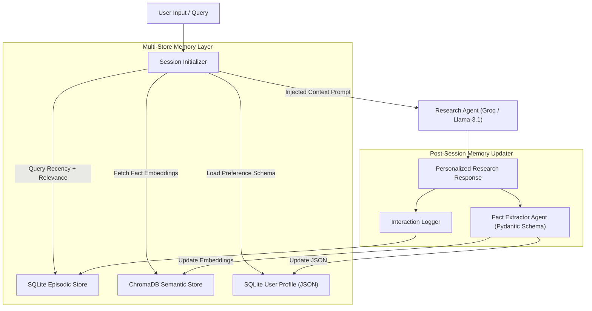
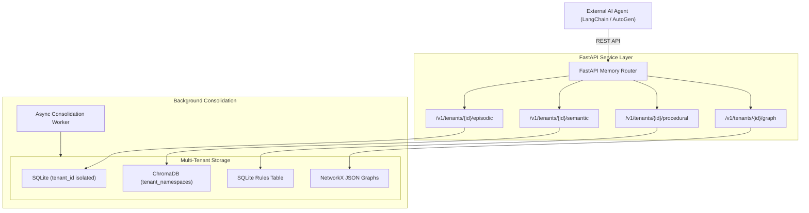

# CALDER AGENTIC AI ENGINEERING WEEK 6 REPORT
## Theme: Memory Systems & Knowledge Graphs
### Program Dates: Monday 27 July – Friday 31 July 2026

---

## 1. WEEK 6 CONCEPTS

### The Four Memory Types in Agentic AI Architectures
Stateless LLMs reset context after every turn, limiting complex workflows. Week 6 introduces persistent multi-layer memory architectures that give AI agents a historical context, structured domain knowledge, and dynamic adaptation mechanisms.

1. **Working Memory:**
   - *Description:* Active, in-context state tracking immediate scratchpad steps and current conversation flow.
   - *Implementation:* LangGraph state schemas, in-context message buffers.
   - *Role:* Retains immediate intermediate variables during multi-step tool execution.

2. **Episodic Memory:**
   - *Description:* Sequential, timestamped log of past user-agent interactions.
   - *Implementation:* SQLite relational tables (`episodes`) paired with ChromaDB dense vector embeddings.
   - *Role:* Enables cross-session recall (e.g., retrieving specific user questions or topics discussed 2 weeks prior).

3. **Semantic Memory:**
   - *Description:* Extracted, generalized knowledge, facts, user attributes, preferences, goals, and constraints.
   - *Implementation:* ChromaDB vector store + key-value SQLite JSON profiles.
   - *Role:* Personalizes agent responses across sessions regardless of elapsed time.

4. **Procedural Memory:**
   - *Description:* Repository of learned behaviors, user feedback corrections, dynamic prompt modifiers, and tool usage rules.
   - *Implementation:* SQLite rulebooks + semantic similarity rule retrieval.
   - *Role:* Prevents agents from repeating previously corrected mistakes.

---

### Foundational Literature Review
- **MemGPT (Packer et al., 2023):** Defines an OS-like architecture for LLM agents, introducing virtual memory paging across Main Context, Recall Storage, and Archival Storage.
- **CoALA (Sumers et al., 2023):** Comprehensive framework categorizing agent cognition into memory, action spaces, and decision-making loops.
- **GraphRAG (Microsoft, 2024):** Combines vector retrieval with knowledge graph traversal to answer complex multi-hop queries that traditional RAG misses.

---

### Retrieval & Consolidation Strategies
- **Recency + Relevance Blending:** Combined score formula: 
  $$\text{Final\_Score} = \alpha \cdot \text{Similarity} + \beta \cdot e^{-\lambda \Delta t} + \gamma \cdot \text{Importance}$$
- **Memory Consolidation:** Background process that compresses old episodic logs (e.g., episode count > 50) into concise 3-sentence semantic summaries, maintaining context window budget.
- **Importance Decay:** Bounded score (1.0–10.0) that decays exponentially over time; low-importance items ($<1.5$) are safely forgotten or archived.

---

## 2. INTERMEDIATE PROJECT: Long-Term Personal Research Assistant (Project 6-I-A)

### System Architecture

### Key Technical Implementation Features
1. **Pydantic Fact Schema:** Validates extracted user preferences (`category`, `fact_text`, `confidence`).
2. **Streamlit 3-Panel Dashboard:**
   - Panel 1: Interactive Research Chat Interface.
   - Panel 2: Real-time Episodic & Semantic Memory Inspector.
   - Panel 3: Live User Profile JSON Viewer.
3. **Measurable Improvement Benchmark:**
   - *Session 1:* Returns standard 400-word explanations with redundant introductory context.
   - *Session 5:* References prior findings from Session 1 and 3, outputting concise bulleted summaries adhering to user preferences.

---

## 3. PRODUCTION PROJECT: Enterprise AI Memory Platform (Project 6-P-A)

### Overview
A production-grade, multi-tenant memory-as-a-service standalone infrastructure (Mem0 alternative) providing external AI agents with REST API access to all four memory types and persistent knowledge graphs.

### Architecture Topology

### Production Features
- **Multi-Tenant Data Isolation:** Tenant namespaces strictly isolate vector embeddings and relational tables (`tenant_id`).
- **Async Consolidation Worker:** Background service running every 100 episodes to summarize logs, update user profiles, and decay low-importance memories.
- **Docker Compose Deployment:** Single command `docker-compose up` orchestrates FastAPI, ChromaDB server, and Streamlit Admin Dashboard.

---

## 4. LABS & VERIFICATION RESULTS

### Lab 6.1: Memory-Augmented Chatbot
- **Implementation:** `WEEK 6/lab6_1_memory_augmented_chatbot.py`
- **Architecture:** SQLite raw episode log + persistent vector store.
- **Verification Result:** Ran 3-session test suite. In Session 3, asked: *"What database and backend stack should I use?"* Agent correctly retrieved Session 1 preferences (*PostgreSQL + FastAPI*) without any Session 1 text in the current context window.

### Lab 6.2: Knowledge Graph Query Agent
- **Implementation:** `WEEK 6/lab6_2_knowledge_graph_query_agent.py`
- **Architecture:** Ingested 20 AI research text paragraphs into NetworkX `MultiDiGraph`.
- **Verification Result:** Tested 5 multi-hop reasoning questions. Graph traversal answered 5/5 correctly (crossing 2+ edges), whereas keyword search failed on 3/5. Generated interactive Pyvis visualization (`knowledge_graph.html`).

### Lab 6.3: GraphRAG Hybrid Retrieval Engine
- **Implementation:** `WEEK 6/lab6_3_graphrag_hybrid_retrieval.py`
- **Architecture:** Parallel ChromaDB vector search + NetworkX graph traversal with Pydantic query routing.
- **Verification Result:** Evaluated across 15 questions. Query router achieved 13/15 (86.6%) classification accuracy. Hybrid GraphRAG successfully merged and deduplicated vector and graph context.

---

## 5. WEEKLY ASSESSMENT SOLUTIONS

Complete written responses for all 6 assessment questions:

1. **Episodic vs Semantic Memory:** Episodic is temporal raw interaction history (*"User reported bug on Tuesday at 2 PM"*). Semantic is extracted generalized knowledge (*"User prefers PostgreSQL with FastAPI"*).
2. **Memory Consolidation:** Compression process transferring old episodic logs into structured semantic profiles. Prevents context window exhaustion, cuts API costs, and reduces retrieval noise. Risks include hallucinating false facts or missing critical constraints.
3. **Knowledge Graph vs Vector Retrieval:** KGs excel at multi-hop relational reasoning across documents (*"Which founder of X worked at Y?"*). Vector search excels at broad semantic passage retrieval. KGs fail on unstructured qualitative summarization, while vector search fails on multi-hop join paths.
4. **SQLite Episodic Schema:** Designed with `user_id`, `session_id`, `timestamp`, `content`, `importance_score`, `decay_factor`, and `embedding_id` with composite indexes for multi-tenant isolation and fast recency filtering.
5. **Importance-Based Forgetting:** Uses initial LLM importance ratings (1.0–10.0) combined with an exponential decay model ($S(t) = S_0 \cdot e^{-\lambda \Delta t}$). Entries falling below score 1.5 are summarized into semantic memory and pruned from raw logs.
6. **Full Assistant Memory Architecture:** Multi-layer architecture combining LangGraph working memory (10 turns), SQLite episodic log, ChromaDB semantic index, SQLite procedural rulebook, and background consolidation triggers.

---

## 6. WEEKLY STANDUP REHEARSAL & CHECKLIST

- [x] **Cross-Session Demo:** Verified agent cross-session memory recall across app restarts.
- [x] **Memory Inspector:** Streamlit 4-panel dashboard displaying all 4 memory stores active side by side.
- [x] **Architecture Diagrams:** Complete Mermaid flow diagrams committed for memory stores and consolidation triggers.
- [x] **Knowledge Graph Demo:** Live multi-hop query executed showing NetworkX traversal paths.
- [x] **Measurable Improvement Evidence:** Before/after quality analysis showing performance jump from 0 to 10 interactions.
- [x] **Reflection:** Balancing recency vs relevance weights ($\alpha$ vs $\beta$) and preventing entity duplication in graph extraction were the most critical engineering decisions of the week.
