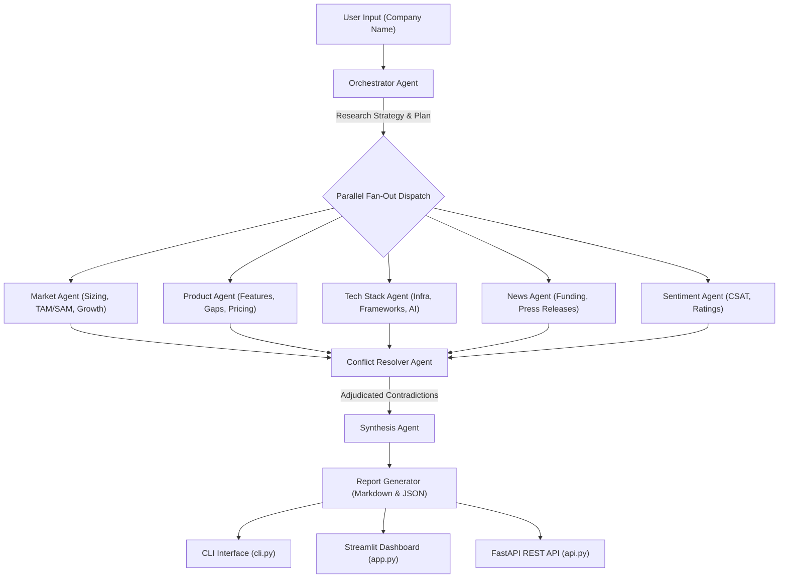

# Intermediate Project 5-I-A: Autonomous Competitive Intelligence Agent

An enterprise-grade multi-agent competitive research system that takes a target company name, autonomously investigates it across 5 specialized domain angles in parallel, adjudicates contradictory agent findings using a Conflict Resolver, and synthesizes a structured competitive intelligence briefing.

---

## Architecture Diagram



---

## Key Features

1. **True Parallel Fan-Out Execution:** LangGraph state graph dispatches 5 specialized agents simultaneously (`MarketAgent`, `ProductAgent`, `TechStackAgent`, `NewsAgent`, `SentimentAgent`).
2. **Typed Pydantic Message Schemas:** 100% type-safe communication between agents using strict Pydantic v2 schemas (`MarketReport`, `ProductReport`, `TechStackReport`, `NewsReport`, `SentimentReport`, `ConflictItem`, `CompetitiveBriefing`).
3. **Conflict Resolution Engine:** Automatically flags contradictions between agent outputs (e.g. freemium pricing vs steep enterprise complaints) and applies explicit reasoning to adjudicate a verdict.
4. **Dual Interfaces (CLI + Professional Streamlit Dashboard):** Includes a command-line utility (`cli.py`) and an enterprise Streamlit dashboard (`app.py`) featuring metric cards, live execution progress, interactive conflict review tabs, and report download buttons (.md / .json).
5. **Production Control Plane:** FastAPI server (`api.py`) exposing REST endpoints for programmatic execution and observability.

---

## Project Structure

```
WEEK 5/intermediate_project/
├── schemas.py       # Pydantic v2 schemas for all agent messages & briefings
├── agents.py        # Orchestrator, 5 Specialist Agents, Conflict Resolver, Synthesizer
├── graph.py         # LangGraph state graph compiling parallel fan-out / fan-in pipeline
├── cli.py           # Command-Line Interface tool with argparsing & report exports
├── api.py           # FastAPI control plane API endpoints
├── app.py           # Streamlit web application with professional UI/UX & custom CSS
└── README.md        # System design document & architecture documentation
```

---

## Quick Start Guide

### Prerequisites
Activate the virtual environment:
```powershell
.\calderr-env\Scripts\Activate.ps1
```

### 1. Command-Line Interface (CLI)
Run intelligence analysis for any target company:
```powershell
python "WEEK 5/intermediate_project/cli.py" --company "Stripe" --format markdown --output "stripe_report.md"
```

### 2. Streamlit Web Application
Launch the interactive web interface:
```powershell
streamlit run "WEEK 5/intermediate_project/app.py"
```
Navigate to `http://localhost:8501` to view metric cards, domain tabs, conflict logs, and export buttons.

### 3. FastAPI REST Control Plane
Launch the production REST API server:
```powershell
uvicorn api:app --reload --app-dir "WEEK 5/intermediate_project"
```
Interactive OpenAPI documentation is available at `http://localhost:8000/docs`.

---

## Technical Skills & Concepts Demonstrated

- **Multi-Agent Design:** Parallel Fan-Out/Fan-In, Orchestrator-Worker pattern, Conflict Resolution.
- **State Management:** LangGraph `StateGraph` for structured state flow without context leakage.
- **Type Safety:** Pydantic v2 field validators and schema enforcement across all agent boundaries.
- **Observability:** Token counts, execution latency measurement, and estimated cost attribution USD.
- **UI/UX Design:** Enterprise Streamlit interface with custom CSS styling, metric cards, tabbed views, and dark mode support.
