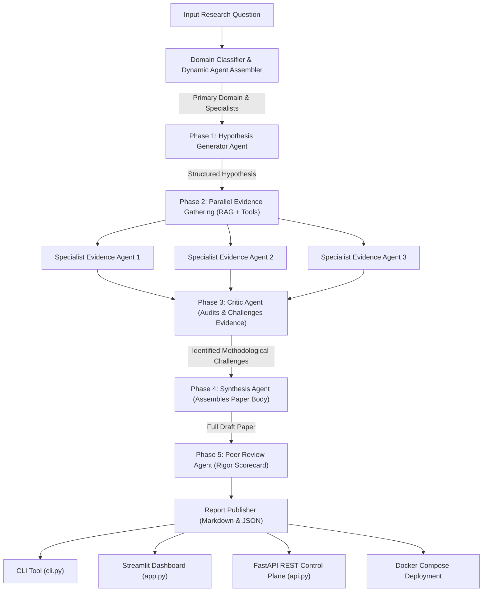

# Category 2 Production Project 5-P-A: Autonomous AI Research Lab

A production-grade, fully autonomous deep research platform that accepts a complex research question, dynamically classifies the research domain, assembles a specialized team of evidence agents, and executes a structured 5-phase research workflow (Hypothesis Generation, Dynamic Evidence RAG, Critic Challenge Audit, Paper Synthesis, Peer Review Audit) to publish formal research reports without human intervention.

---

## 5-Phase Architecture Diagram



---

## The 5 Research Phases

1. **Phase 1: Domain Classification & Hypothesis Proposal**
   - Dynamically identifies the primary domain (e.g. Distributed AI, Healthcare, Finance, Cybersecurity) and selects 3-5 specialized evidence agents. Proposes a testable hypothesis with expected outcomes and failure modes.
2. **Phase 2: Dynamic Specialist Assembly & Parallel Evidence RAG**
   - Dispatches parallel evidence gatherer agents executing vector RAG search over knowledge stores and tool calls to gather empirical evidence items.
3. **Phase 3: Critic Agent Evidence Challenge Audit**
   - Audits all gathered evidence items against the initial hypothesis, explicitly challenging weak links, methodological qualifications, and unsupported claims.
4. **Phase 4: Synthesis Agent Paper Body Assembly**
   - Writes the formal, structured research paper body with explicit evidence citations, agent attributions, and critic challenge qualifications.
5. **Phase 5: Peer Review Agent Audit & Final Publication**
   - Conducts a second-pass quality check, calculating scores for Methodological Rigor, Citation Completeness, and Logical Coherence, before publishing the final report.

---

## Project Structure

```
WEEK 5/production_project/
├── schemas.py          # Typed Pydantic models for domain, hypothesis, evidence, critic, peer review
├── agents.py           # Implementations of DomainClassifier, HypothesisGenerator, EvidenceAgents, Critic, Synthesizer, PeerReviewer
├── graph.py            # LangGraph 5-phase state graph pipeline
├── cli.py              # Command-Line Interface tool with argparsing & report exports
├── api.py              # FastAPI control plane API endpoints
├── app.py              # Streamlit web application with 5-phase stepper, scorecard, and exports
├── Dockerfile          # Container build specification
├── docker-compose.yml  # Multi-service deployment (FastAPI + Streamlit)
├── requirements.txt    # Production dependencies
└── README.md           # System design document & architecture documentation
```

---

## Quick Start Guide

### Prerequisites
Activate the virtual environment:
```powershell
.\calderr-env\Scripts\Activate.ps1
```

### 1. Command-Line Interface (CLI)
Execute an autonomous deep research run:
```powershell
python "WEEK 5/production_project/cli.py" --question "Evaluate multi-agent orchestration frameworks for enterprise production" --format markdown
```

### 2. Streamlit Control Plane Web UI
Launch the interactive web application:
```powershell
streamlit run "WEEK 5/production_project/app.py"
```
Navigate to `http://localhost:8501` to view phase steppers, peer review scorecards, critic challenge diffs, and report download buttons (.md / .json).

### 3. FastAPI REST Control Plane API
Launch the REST API server using the virtual environment:
```powershell
.\calderr-env\Scripts\python.exe -m uvicorn api:app --reload --app-dir "WEEK 5/production_project"
```
Interactive OpenAPI documentation is available at `http://localhost:8000/docs`.

### 4. One-Command Containerized Deployment (Docker Compose)
Start the entire stack (FastAPI backend + Streamlit frontend):
```bash
docker-compose up --build
```

---

## Technical Skills & Concepts Demonstrated

- **Multi-Phase Agent Orchestration:** LangGraph 5-phase state graph chaining Domain Classifier $\rightarrow$ Dynamic Agent Assembler $\rightarrow$ Hypothesis Generator $\rightarrow$ Parallel RAG Evidence Gatherers $\rightarrow$ Critic Agent $\rightarrow$ Synthesis Agent $\rightarrow$ Peer Review Agent.
- **Critic & Peer Review Patterns:** Automatic challenge auditing and second-pass peer review scorecards.
- **RAG & Tool Integration:** Context retrieval and evidence attribution across specialized domain agents.
- **Observability & Cost Attribution:** Per-phase token counts, execution latency, and estimated cost attribution USD.
- **Production Architecture:** FastAPI REST API, Streamlit Web Dashboard, Dockerfile, and Docker Compose deployment.
