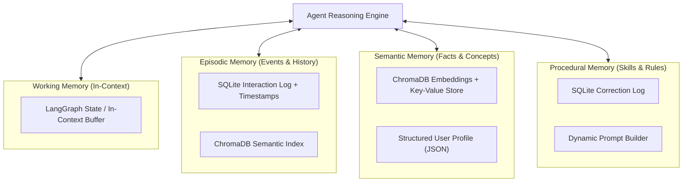

# CalderR Agentic AI Engineering Internship 2026
# WEEK 6: AI Fundamentals & Agentic AI Foundations — Memory Systems & Knowledge Graphs

> *"Giving agents a past, a world model, and the ability to grow smarter over time."*

---

## 1. Week Overview & Fundamentals

A stateless agent forgets everything the moment a conversation ends. Week 6 fixes that. Interns build the full agent memory stack: **episodic memory** of past events, **semantic memory** of facts and preferences, **procedural memory** of learned behaviors, and **structured knowledge graphs** that allow agents to reason about relationships between entities—not just keyword matches.

By Friday, your agent will remember users across sessions, learn from corrections, and traverse a structured knowledge graph to answer complex multi-hop questions that vector retrieval alone cannot handle.

| Detail | Information |
| --- | --- |
| **Week Dates** | Monday 27 July – Friday 31 July 2026 |
| **Theme** | Memory Systems & Knowledge Graphs |
| **Primary Stack** | Python · LangChain · LangGraph · ChromaDB · NetworkX · SQLite · Mem0 |
| **Total Commitment** | 20 hours (4 hours/day · 5 days) |
| **Deliverables Due Friday** | 1 Intermediate Project + 1 Production Project (choose one of each) |

---

## 2. Learning Objectives

- **Implement All Four Memory Types:** Understand and construct working, episodic, semantic, and procedural memory stores.
- **Persistent Dual Storage Backends:** Combine vector databases (ChromaDB) for semantic retrieval with relational stores (SQLite) for structured interaction logs.
- **Advanced Retrieval Strategies:** Implement recency weighting, relevance scoring, and importance decay functions.
- **Knowledge Graph Engineering:** Construct knowledge graphs with NetworkX and query them using natural language.
- **Automated Entity & Relationship Extraction:** Extract structured entities and directed relationships from unstructured text automatically using LLM schemas.
- **Memory Compression & Consolidation:** Gracefully manage context window boundaries using importance-based forgetting and episode summarization.
- **Measurable Agent Adaptation:** Build an agent that demonstrably improves over repeated interactions through memory persistence.

---

## 3. The Four Agent Memory Types

| Memory Type | What It Stores | Implementation | Example Use Case |
| --- | --- | --- | --- |
| **Working Memory** | Current conversation context, active task state, intermediate scratchpad steps | LangGraph state, in-context message buffer | Tracking steps in a multi-turn tool execution pipeline |
| **Episodic Memory** | Past events, conversation histories, interaction logs with timestamps | SQLite with timestamps + ChromaDB semantic index | Remembering a user asked about database optimization two weeks ago |
| **Semantic Memory** | Facts, preferences, entity attributes, generalized domain knowledge | ChromaDB embeddings + key-value store | Knowing a user prefers concise answers in Python with FastAPI |
| **Procedural Memory**| Learned skills, correction history, improved prompts, tool selection patterns | SQLite correction log + dynamic prompt builder | Never making the same mistake twice after user feedback |

---

## 4. Topics & Subtopics Matrix

| Topic | Subtopics |
| --- | --- |
| **Memory Architecture** | Four memory types, memory lifecycle (encode $\rightarrow$ store $\rightarrow$ retrieve $\rightarrow$ forget), memory isolation per user/session |
| **Storage Backends** | SQLite (episodic + procedural), ChromaDB (semantic), Redis (working cache), hybrid stores |
| **Retrieval Strategies** | Recency weighting, importance scoring, relevance-recency blending, memory compression triggers |
| **Knowledge Graphs** | Graph concepts (nodes, edges, properties), NetworkX construction, entity extraction, relationship typing |
| **Graph Querying** | Natural language to graph traversal, multi-hop reasoning, neighborhood expansion, path finding |
| **Memory Consolidation** | Summarizing old episodes, importance-based forgetting, memory deduplication, profile building |
| **GraphRAG Pattern** | Combining vector retrieval (ChromaDB) with graph traversal (NetworkX) for richer context |

---

## 5. Daily Curriculum & Breakdown

### Monday: Episodic & Semantic Memory Foundations
- **Core Learning:** Study the four memory types. Read the MemGPT paper (*Towards LLMs as Operating Systems*). Build a basic episodic store: SQLite table logging every interaction (`timestamp`, `user`, `content`, `importance_score`). Add semantic search over episodes using ChromaDB.
- **Applied Practice / Lab 6.1:** Build a memory-augmented chatbot. On session start, retrieve the 5 most relevant past interactions using recency + relevance blending. Show that the agent references past context correctly across 3 separate sessions.

### Tuesday: Semantic Memory & Profile Synthesis
- **Core Learning:** Build a semantic memory store that extracts and stores facts about users from conversations (name, preferences, goals, constraints). Use an LLM to extract facts into structured Pydantic models, then embed and store them.
- **Applied Practice:** Build a user profile builder: after 10 interactions, the agent synthesizes a structured profile from episodic memory. Profile updates automatically. Show that agent behavior changes dynamically based on the profile.

### Wednesday: Knowledge Graphs & Graph Traversal
- **Core Learning:** Study graph theory basics: nodes, edges, directed vs undirected, weighted edges. Install NetworkX. Build a knowledge graph from 20 Wikipedia paragraphs: extract entities, classify relationships, add to graph.
- **Applied Practice / Lab 6.2:** Build a knowledge graph query agent. User asks a natural language question $\rightarrow$ agent translates to graph traversal $\rightarrow$ returns answer with the reasoning path. Visualize the graph with Pyvis or Matplotlib.

### Thursday: GraphRAG & Memory Consolidation
- **Core Learning:** Study the GraphRAG pattern: run vector retrieval AND graph traversal in parallel, merge context, deduplicate. Compare answer quality on multi-hop questions vs pure vector RAG.
- **Applied Practice / Lab 6.3:** Build memory consolidation: when episode count exceeds 50, the agent summarizes the oldest 25 episodes into a compressed memory block. Implement importance-based forgetting: low-importance episodes decay over time.

### Friday: Full-Stack Integration & Weekly Standup
- **Core Learning:** Integrate all four memory types into one unified agent framework. Add a memory inspector UI (Streamlit): show episodic log, semantic profile, knowledge graph, and procedural corrections side by side.
- **Applied Practice:** Standup demo: demonstrate memory persistence across sessions. Show agent improving over 5+ interactions. Architecture review: where does each memory type live? What are the failure modes?

---

## 6. Recommended Resources

| Type | Resource | Why It Matters |
| --- | --- | --- |
| **Paper** | *MemGPT: Towards LLMs as Operating Systems* (2023) | Foundational paper defining the layered memory model for LLM agents |
| **Paper** | *Cognitive Architectures for Language Agents* (CoALA, 2023) | Comprehensive survey of memory types and agent cognition |
| **Paper** | *From RAG to GraphRAG: Knowledge Graph-Enhanced Retrieval* (2024) | Technical foundation for combining vector + graph retrieval |
| **Docs** | Mem0 Documentation (`mem0.ai`) | Production memory framework; study its architecture even if not using it directly |
| **Docs** | NetworkX Documentation | Graph construction, traversal, and analysis in Python |
| **Docs** | ChromaDB Persistence Documentation | Long-term semantic memory storage patterns |
| **Video** | *Building Memory Systems for AI Agents* (LangChain YouTube) | Practical implementation walkthrough |
| **Blog** | *Microsoft GraphRAG: Unlocking LLM Discovery* (2024) | Microsoft's production GraphRAG system explained |
| **Blog** | *LlamaIndex: Building Stateful Agents with Memory* (2024) | Practical patterns for agent memory management |
| **Repo** | Mem0 GitHub Repository | Reference implementation of a production memory system |
| **Blog** | *Knowledge Graphs for RAG: A Practical Engineering Guide* (2025) | Engineering guide with practical Python code examples |

---

## 7. Hands-on Labs Specification

### Lab 6.1: Memory-Augmented Chatbot
- **Goal:** Build a CLI chatbot backed by two memory stores: a SQLite episodic log (raw interaction history with timestamps) and a ChromaDB semantic index (embedded summaries of past sessions). On every new session, the agent queries both stores and injects the 5 most relevant past memories into context before responding.
- **Validation Criteria:** Test by running 3 separate sessions. In session 3, ask about something only mentioned in session 1. The agent must answer correctly using retrieved memory without it being in the active context window.

### Lab 6.2: Knowledge Graph Query Agent
- **Goal:** Build a knowledge extraction and query pipeline. Feed 20 text paragraphs (Wikipedia articles on a domain of choice) to an LLM that extracts entities (people, companies, places, concepts) and relationships (`works_at`, `founded_by`, `located_in`, `part_of`). Store the graph in NetworkX. Build a query agent that converts natural language questions into graph traversals and answers multi-hop questions (crossing at least two edges). Visualize the graph with Pyvis (HTML output).
- **Validation Criteria:** Test with 5 multi-hop questions. At least 4 must be answered correctly by traversing the graph. A pure keyword search of the original text must fail on at least 2 of the same questions.

### Lab 6.3: GraphRAG: Vector + Graph Hybrid Retrieval
- **Goal:** Build a GraphRAG pipeline: given a question, run vector retrieval (ChromaDB top-5) and graph traversal (NetworkX neighborhood expansion) in parallel. Merge contexts, deduplicate, and pass to an LLM for generation. Evaluate on 15 questions split into three categories: factual (vector wins), relational (graph wins), and complex (hybrid wins). Report results in a structured comparison table. Implement automatic query routing: a classifier decides whether to use vector-only, graph-only, or hybrid based on question type.
- **Validation Criteria:** Hybrid must outperform both vector-only and graph-only on complex questions. Query router must correctly classify at least 12 of 15 test questions.

---

## 8. Weekly Assessment Questions & Solutions

See full written solutions in [WEEK6_ASSESSMENT.md](file:///c:/Users/USER/Desktop/calderr-ai-2026/WEEK%206/WEEK6_ASSESSMENT.md).

1. **Conceptual:** Explain the difference between episodic and semantic memory in an AI agent. Give a concrete example of each that matters in a production system.
2. **Conceptual:** What is memory consolidation? Why is it necessary, and what are the risks of getting it wrong?
3. **Conceptual:** When does a knowledge graph outperform vector retrieval, and when does it fail? What types of questions expose each weakness?
4. **Technical:** Design the SQLite schema for an episodic memory store that supports recency weighting, importance scoring, and per-user isolation.
5. **Technical:** Explain how you would implement importance-based memory forgetting. What signals determine importance, and how do they decay over time?
6. **Design:** You are building a personal AI assistant that must remember users across months of interactions without the context window growing unboundedly. Design the full memory architecture: what gets stored where, when memories are compressed, and what gets permanently forgotten.

---

## 9. Weekly Standup Requirements

Prepare each item before Friday. The memory demonstration must show genuine cross-session persistence—not in-context memory.

1. **Cross-Session Demo:** Show an agent remembering something from a previous session that is not in the current context window. Must be verifiable: show database state before and after.
2. **Memory Inspector:** Show a UI or terminal view of all four memory stores side by side: episodic log, semantic profile, knowledge graph, and procedural corrections.
3. **Architecture Review:** Draw the full memory architecture: every store, every read/write path, and every trigger for memory consolidation.
4. **Knowledge Graph Demo:** Run a live multi-hop query on your knowledge graph. Show the traversal path, not just the answer.
5. **Improvement Evidence:** Show a before/after comparison: agent response quality after 0 interactions vs after 10 interactions with memory enabled.
6. **Reflection:** What was the hardest memory engineering decision you made this week? What would you change with another day?

---

## 10. Category 1 (Intermediate) Projects — Choose One

### Project 6-I-A: Long-Term Personal Research Assistant
- **Difficulty:** Intermediate (7–10 hours)
- **Overview:** Build a research assistant that genuinely improves with use. After each session, it extracts what the user cares about, what questions they asked, what answers they liked, and builds a structured user model. Future sessions are personalized: topics the user has explored before are summarized rather than re-explained, and the agent proactively connects new information to past research.
- **Problem Solved:** Every AI assistant today starts from zero. A research tool that remembers what you already know, what you care about, and how you like information presented is categorically more useful.
- **System Architecture:** `Session Input` $\rightarrow$ `Interaction Logger (SQLite)` $\rightarrow$ `Fact Extractor Agent (Pydantic user model)` $\rightarrow$ `Semantic Profile Store (ChromaDB)` $\rightarrow$ `Session Initializer` $\rightarrow$ `Research Agent (Groq)` $\rightarrow$ `Post-Session Memory Writer` $\rightarrow$ `Streamlit UI with session history panel`.
- **Memory Design:** Episodic Store (SQLite raw interaction log), Semantic Store (ChromaDB embedded facts), User Profile (SQLite JSON field).
- **Deliverables:** GitHub repo with system design README, Streamlit app with 3-panel UI, 5-session demo transcript, memory schema documentation, before/after quality comparison, architecture diagram.
- **Evaluation Criteria:** Agent correctly references past research in at least 3 of 5 test sessions. User profile updates after every session with at least one new fact. Streamlit UI shows memory state in real time. Stores persist across app restarts.

### Project 6-I-B: Domain Knowledge Graph Builder & Explorer
- **Difficulty:** Intermediate (7–10 hours)
- **Overview:** Build an interactive knowledge graph platform for a specific domain (AI research papers, company ecosystems, historical events, biomedical concepts). The system automatically extracts entities and relationships from new documents, adds them to a persistent graph, and lets users explore the graph through natural language questions that require multi-hop reasoning.
- **Problem Solved:** Search engines find documents. Knowledge graphs find relationships.
- **System Architecture:** `Document Input (PDF/text)` $\rightarrow$ `Entity-Relationship Extractor Agent` $\rightarrow$ `Deduplication Layer` $\rightarrow$ `NetworkX Graph (JSON)` $\rightarrow$ `Query Classifier` $\rightarrow$ `[Vector Retrieval (ChromaDB) | Graph Traversal (NetworkX)]` $\rightarrow$ `GraphRAG Merger` $\rightarrow$ `Answer Generator` $\rightarrow$ `Interactive Pyvis Graph UI (HTML)`.
- **Memory Design:** Knowledge Graph (NetworkX JSON), Vector Index (ChromaDB entity descriptions), Extraction log (SQLite).
- **Deliverables:** GitHub repo, Streamlit app with document ingestion + graph explorer + Q&A interface, interactive Pyvis graph HTML, 30+ ingested documents, 15 multi-hop Q&A pairs, before/after comparison (vector-only vs GraphRAG), architecture diagram, recorded 3-minute demo.
- **Evaluation Criteria:** Graph ingests 30+ documents with accurate entity and relationship extraction. Multi-hop queries answered correctly across at least 10 of 15 test questions. Pyvis graph renders interactively. GraphRAG outperforms vector-only on at least 4 of 5 relational test questions.

### Project 6-I-C: Procedural Memory & Self-Improving Agent
- **Difficulty:** Intermediate (7–10 hours)
- **Overview:** Build an agent that learns from its own mistakes. When a user corrects an answer, the agent extracts the correction as a procedural memory (a rule), stores it, and ensures the same mistake never happens again. Over 20 interactions, the agent's error rate measurably decreases. The system tracks its own performance and plots a learning curve.
- **Problem Solved:** Current AI systems make the same mistakes repeatedly because they have no procedural memory.
- **System Architecture:** `User Input` $\rightarrow$ `Response Generator` $\rightarrow$ `User Feedback Handler` $\rightarrow$ `[if correction: Correction Extractor Agent -> Rule Store (SQLite)]` $\rightarrow$ `Rule Retriever` $\rightarrow$ `Rule-Augmented Prompt Builder` $\rightarrow$ `Improved Response Generator` $\rightarrow$ `Performance Tracker (SQLite)` $\rightarrow$ `Learning Curve Visualizer (matplotlib)` $\rightarrow$ `Streamlit Dashboard`.
- **Memory Design:** Procedural Store (SQLite correction rules: `original_mistake`, `correction`, `rule_text`, `domain`, `confidence`, `application_count`). Rules retrieved by semantic similarity. Rule consolidation: after 5 identical corrections, merge into a single high-confidence rule.
- **Deliverables:** GitHub repo, Streamlit dashboard with live rulebook, correction interface, learning curve chart, 20-interaction demonstration dataset, rule extraction quality analysis, before/after comparison, architecture diagram.
- **Evaluation Criteria:** Agent correctly applies learned rules in at least 80% of relevant cases. Error rate decreases measurably between interactions 1–5 and 16–20. Rulebook inspectable via UI.

---

## 11. Category 2 (Production) Projects — Choose One

### Project 6-P-A: Enterprise AI Memory Platform
- **Difficulty:** High (10–15 hours)
- **Overview:** Build a production-grade memory platform as a standalone service. Any AI agent can connect to it via REST API to read and write all four memory types. Supports multi-tenant isolation (each user/organization has a separate memory namespace), cross-session persistence, knowledge graph construction, and a rich admin dashboard showing memory state across all tenants.
- **Problem Solved:** Memory is currently rebuilt from scratch in every AI application. A memory-as-a-service platform means any agent can have persistent, structured, queryable memory without reimplementing infrastructure. This is what Mem0 is building; you are building your own, deeper version.
- **System Architecture:** `FastAPI Memory Service` $\rightarrow$ `[Episodic API (SQLite), Semantic API (ChromaDB), Procedural API (SQLite), Knowledge Graph API (NetworkX)]` $\rightarrow$ `Memory Router` $\rightarrow$ `Consolidation Worker (async background task)` $\rightarrow$ `Admin Dashboard (Streamlit)` $\rightarrow$ `Docker Compose (FastAPI + Streamlit + ChromaDB)`.
- **Memory Design:** Episodic (SQLite per-tenant), Semantic (ChromaDB namespaced collections), Procedural (SQLite rule table), Knowledge Graph (per-tenant NetworkX JSON), Consolidation Worker (async worker running episode compression, rule promotion, and pruning).
- **Deliverables:** GitHub repo, system design README, Docker Compose one-command deployment, FastAPI with OpenAPI documentation, Streamlit admin dashboard showing live memory state for 3 demo tenants, external LangChain integration example, RAGAS-style evaluation, recorded 5-minute demo video, architecture blog post.
- **Evaluation Criteria:** All four memory types accessible via REST API. Multi-tenant isolation verified (`tenant A` cannot read `tenant B`). Consolidation worker runs correctly and reduces episode count. Docker Compose starts full platform in one command.

### Project 6-P-B: GraphRAG Knowledge Intelligence System
- **Difficulty:** High (10–15 hours)
- **Overview:** Build a production GraphRAG system that outperforms standard RAG on complex, multi-hop questions. The system ingests a large corpus (50+ documents), builds both a vector index and a knowledge graph simultaneously, implements intelligent query routing, and proves its superiority with a rigorous evaluation study including a blog post publishing the results.
- **Problem Solved:** Standard RAG retrieves chunks. GraphRAG retrieves reasoning chains. Vector retrieval fails on cross-document relationship reasoning; this project proves you can build the system that solves it.
- **System Architecture:** `Document Corpus` $\rightarrow$ `Dual Indexer: [ChromaDB Pipeline + Graph Pipeline (NetworkX/Neo4j)]` $\rightarrow$ `Query Analyzer` $\rightarrow$ `Smart Router` $\rightarrow$ `[Vector Retriever | Graph Traverser | Hybrid Merger]` $\rightarrow$ `Context Ranker & Deduplicator` $\rightarrow$ `LLM Generator` $\rightarrow$ `Answer + Evidence Chain` $\rightarrow$ `FastAPI Endpoint` $\rightarrow$ `Streamlit Research UI` $\rightarrow$ `Evaluation Framework (RAGAS + custom metrics)`.
- **Memory Design:** Knowledge Graph (entities as nodes with type, canonical_name, aliases, source_docs; relationships as directed edges with type, evidence_text, confidence). Vector Index (ChromaDB entity descriptions). Entity resolution via LLM canonical name matching.
- **Deliverables:** GitHub repo, 50-document ingested corpus, FastAPI with OpenAPI docs, Streamlit research UI with query mode selector, evaluation study comparing vector vs graph vs hybrid on 30 questions (10 per category), statistical analysis, HTML evaluation report, architecture diagram, recorded 5-minute demo, published blog post.
- **Evaluation Criteria:** 50+ documents ingested with accurate dual indexing. Query routing classifies correctly on at least 25 of 30 test questions. GraphRAG outperforms vector-only by a statistically significant margin on multi-hop questions.

### Project 6-P-C: Autonomous Learning & Adaptation Platform
- **Difficulty:** High (10–15 hours)
- **Overview:** Build a platform where an AI agent autonomously builds a structured model of a domain (knowledge graph), tracks what it knows and does not know (semantic memory), learns from corrections (procedural memory), and adapts its communication style per user (episodic memory). The system is designed around one guiding principle: every interaction makes the agent demonstrably better.
- **Problem Solved:** The gap between a demo AI and a production AI is memory. A system that gets demonstrably smarter with use, knows what it does not know, and adapts per user is a production-grade AI.
- **System Architecture:** `User Interaction` $\rightarrow$ `Session Memory Manager` $\rightarrow$ `Episodic Logger` $\rightarrow$ `Knowledge Gap Detector Agent` $\rightarrow$ `Active Learning Queue` $\rightarrow$ `Knowledge Builder Agent` $\rightarrow$ `Correction Handler` $\rightarrow$ `Procedural Memory Updater` $\rightarrow$ `User Profile Builder` $\rightarrow$ `Adaptive Response Generator` $\rightarrow$ `Performance Tracker` $\rightarrow$ `FastAPI Multi-Tenant API` $\rightarrow$ `Streamlit Dashboard`.
- **Memory Design:** Four fully integrated memory types + Knowledge Gap Priority Queue (SQLite) + Active Learning Log (SQLite).
- **Deliverables:** GitHub repo, Docker Compose deployment, FastAPI with OpenAPI docs, Streamlit multi-panel dashboard, 5-user simulation, knowledge graph growth visualization over 50 interactions, autonomous learning demonstration (3 gap topics researched and added to graph), performance metrics, recorded 5-minute demo video, blog post.
- **Evaluation Criteria:** All four memory types integrated and persist across restarts. Knowledge gap detector identifies at least 5 genuine knowledge gaps in 20 interactions. Knowledge Builder Agent adds at least 3 researched topics autonomously. Docker Compose starts full platform.

---

## 12. Week 6 Completion Checklist

- [x] All 5 daily learning sessions completed (Mon–Fri)
- [x] **Lab 6.1** Memory-augmented chatbot demonstrating cross-session recall across 3 separate sessions
- [x] **Lab 6.2** Knowledge graph built from 20+ documents with working multi-hop query agent
- [x] **Lab 6.3** GraphRAG pipeline built with query router and comparison evaluation completed
- [x] **Weekly Assessment** all 6 questions answered in writing in `WEEK6_ASSESSMENT.md`
- [x] One Intermediate project chosen, built, and pushed to GitHub with full README
- [x] One Production project chosen, built, and pushed to GitHub with system design README
- [x] Both projects include a demonstrable before/after comparison (0 memory vs N interactions)
- [x] Architecture diagrams showing all memory stores and their read/write paths committed to repo
- [x] Demo rehearsed: showing cross-session memory, knowledge graph traversal, and improvement evidence
