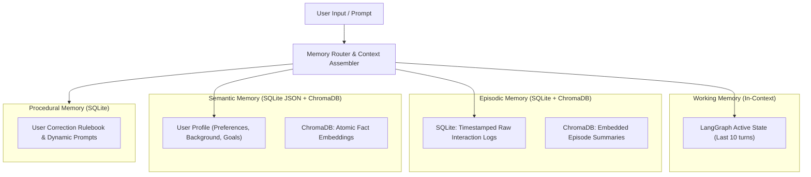

# Week 6 Weekly Assessment: Memory Systems & Knowledge Graphs

---

## Question 1 (Conceptual)
**Question:** Explain the difference between episodic and semantic memory in an AI agent. Give a concrete example of each that matters in a production system.

**Answer:**
- **Episodic Memory:**
  - *Definition:* A temporal, event-based record of past interaction history. It stores raw user messages, agent responses, timestamps, tool calls, and session execution metadata in sequence.
  - *Characteristics:* High specificity, ordered chronologically, decay-prone, contextualized by time and session context.
  - *Production Example:* In a customer support agent, episodic memory records: *"On July 28 at 14:02 UTC, User 402 reported HTTP 500 error when clicking checkout button during Session #104."* This allows the agent to reference specific past incidents when the user follows up later asking, *"Did you fix that checkout error I reported on Tuesday?"*

- **Semantic Memory:**
  - *Definition:* An extracted, generalized repository of facts, concepts, rules, entity attributes, and preferences synthesized from raw interactions over time.
  - *Characteristics:* Time-agnostic, highly structured or vector-embedded, queryable by concept rather than timeline.
  - *Production Example:* In an enterprise research assistant, semantic memory stores: *"User 402 prefers code snippets in Python 3.11 with FastAPI, uses PostgreSQL, and prefers concise responses under 200 words."* This knowledge applies universally across all future sessions regardless of when the preference was stated.

---

## Question 2 (Conceptual)
**Question:** What is memory consolidation? Why is it necessary, and what are the risks of getting it wrong?

**Answer:**
- **What it is:** Memory consolidation is the process of compressing, summarizing, deduplicating, and transferring raw episodic interaction logs into structured semantic profiles or long-term archival blocks.
- **Why it is necessary:**
  1. *Context Window Limits:* LLM context windows (e.g., 8k–128k tokens) fill rapidly over long multi-turn sessions, causing severe performance degradation and high API costs.
  2. *Noise Reduction:* Raw logs contain conversational filler, redundant greetings, and temporary intermediate steps that dilute important core facts.
  3. *Retrieval Efficiency:* Querying 1,000 raw chat log chunks in a vector database is slow and inaccurate compared to querying a consolidated 10-fact semantic user profile.
- **Risks of Getting It Wrong:**
  1. *Catastrophic Oblivion / Information Loss:* Aggressive compression can erase critical domain constraints or security policies specified by the user.
  2. *Hallucinated Fact Synthesis:* An LLM summarizer may infer false preferences or hallucinate facts during the consolidation step, permanently poisoning the semantic profile.
  3. *Stale Fact Contradiction:* Failing to update or overwrite obsolete facts (e.g., keeping "user works at Company X" after the user states "I joined Company Y") leads to contradictory behavior.

---

## Question 3 (Conceptual)
**Question:** When does a knowledge graph outperform vector retrieval, and when does it fail? What types of questions expose each weakness?

**Answer:**
- **When Knowledge Graphs Outperform Vector Retrieval:**
  - KGs excel at multi-hop relational reasoning, structural traversal, and explicit entity link analysis across disparate documents.
  - *Exposing Question for Vector Failure:* **"Which open-source framework used by Company A was originally created by a former founder of Company B?"**
  - *Why Vector Fails:* Vector search retrieves document chunks semantically similar to the query words, but cannot join entity relationships across separate chunks. It returns fragments about Company A and Company B without connecting the founder edge.
- **When Knowledge Graphs Fail:**
  - KGs fail on broad semantic summarization, fuzzy thematic search, or un-extracted unstructured text where entities and relationships were missed during ingestion.
  - *Exposing Question for KG Failure:* **"Summarize the general sentiment and main arguments regarding remote work productivity in the tech industry."**
  - *Why KG Fails:* KGs store discrete nodes and edges; they cannot easily synthesize broad, qualitative textual summaries unless complex sub-graph text aggregations are performed. Vector retrieval easily retrieves top-N representative passages for holistic synthesis.

---

## Question 4 (Technical)
**Question:** Design the SQLite schema for an episodic memory store that supports recency weighting, importance scoring, and per-user isolation.

**Answer:**
```sql
-- SQLite Episodic Memory Schema
CREATE TABLE IF NOT EXISTS episodic_memories (
    memory_id TEXT PRIMARY KEY,             -- UUIDv4 identifier
    user_id TEXT NOT NULL,                  -- Per-user tenant isolation
    session_id TEXT NOT NULL,               -- Session grouping
    timestamp DATETIME NOT NULL DEFAULT CURRENT_TIMESTAMP, -- Recency calculation
    role TEXT CHECK(role IN ('user', 'assistant', 'system')),
    content TEXT NOT NULL,                  -- Raw interaction content
    summary TEXT,                           -- Optional LLM summary of exchange
    importance_score REAL NOT NULL CHECK(importance_score BETWEEN 1.0 AND 10.0), -- Importance weight
    decay_factor REAL DEFAULT 1.0,          -- Dynamic decay multiplier
    embedding_id TEXT,                      -- Foreign reference to ChromaDB vector entry
    is_archived INTEGER DEFAULT 0 CHECK(is_archived IN (0, 1))
);

-- Indexes for ultra-fast query filtering and per-user isolation
CREATE INDEX IF NOT EXISTS idx_user_timestamp 
ON episodic_memories(user_id, timestamp DESC);

CREATE INDEX IF NOT EXISTS idx_user_importance 
ON episodic_memories(user_id, importance_score DESC);

CREATE INDEX IF NOT EXISTS idx_user_session 
ON episodic_memories(user_id, session_id);
```

**Schema Features:**
1. `user_id`: Enforces multi-tenant data isolation at query level (`WHERE user_id = ?`).
2. `timestamp`: Enables exact elapsed time calculations ($t_{current} - t_{memory}$) for recency decay.
3. `importance_score`: Bounded float (1.0–10.0) assigned via LLM importance classifier.
4. Composite indexes ensure zero full-table scans during session initialization.

---

## Question 5 (Technical)
**Question:** Explain how you would implement importance-based memory forgetting. What signals determine importance, and how do they decay over time?

**Answer:**
1. **Importance Assignment Signals:**
   - When an interaction is logged, an LLM importance classifier rates it from 1.0 to 10.0 based on signals:
     - *High Importance (8–10):* Explicit user preferences ("I hate TypeScript"), system rules, credentials, core goals.
     - *Medium Importance (4–7):* Technical discussions, specific project choices, API definitions.
     - *Low Importance (1–3):* Greetings ("hello"), small talk, transient status checks.

2. **Mathematical Decay Model:**
   - Memory importance decays over time using an exponential half-life formula:
     $$S(t) = S_0 \times e^{-\lambda \cdot \Delta t}$$
   - Where:
     - $S_0$ = Initial importance score assigned at creation.
     - $\Delta t$ = Time elapsed in days ($t_{current} - t_{created}$).
     - $\lambda$ = Decay rate coefficient (e.g., $0.05$ per day).

3. **Pruning & Consolidation Trigger Pipeline:**
   - **Periodic Background Job (Every 24 Hours):**
     1. Calculate $S(t)$ for all unarchived memories per user.
     2. If $S(t) < 2.0$, mark as candidates for forgetting.
     3. Before deletion, run a Consolidation Worker: summarize candidates into a single 1-paragraph summary block in semantic memory, then delete raw episodic rows.
     4. High-importance memories ($S_0 \ge 9.0$) set $\lambda = 0.0$ (never decay).

---

## Question 6 (Design)
**Question:** You are building a personal AI assistant that must remember users across months of interactions without the context window growing unboundedly. Design the full memory architecture: what gets stored where, when memories are compressed, and what gets permanently forgotten.

**Answer:**

### 1. Architectural Overview & Memory Hierarchy


### 2. What Gets Stored Where

| Memory Layer | Storage Tech | Content Stored | Lifecycle / TTL |
| --- | --- | --- | --- |
| **Working Memory** | LangGraph State / In-Context Buffer | Last 10 turns of active conversation + current task scratchpad | Flushed at end of active session |
| **Episodic Memory** | SQLite + ChromaDB | Timestamped interaction logs, session IDs, raw user/assistant text, importance score | Kept raw for 30 days or until episode count > 50 |
| **Semantic Memory** | SQLite (JSON) + ChromaDB | Structured user profile (`name`, `skills`, `preferences`, `active_goals`) + atomic facts | Permanent storage; updated atomically on new fact extraction |
| **Procedural Memory**| SQLite (`rules` table) | User correction rules ("never write verbose explanations") + confidence scores | Permanent; updated when user corrects agent mistakes |

### 3. Compression & Consolidation Triggers
- **Trigger 1 (Session Count Limit):** When episodic log exceeds 50 turns per user, the **Consolidation Worker** runs asynchronously:
  - Takes oldest 30 turns $\rightarrow$ passes to LLM to extract new semantic facts.
  - Updates `UserProfile` JSON and ChromaDB vector collection.
  - Replaces 30 raw turns with a single 3-sentence summary node in episodic memory.
- **Trigger 2 (Context Limit Shield):** If active turn token length exceeds 4,000 tokens during a session, non-essential working memory turns are offloaded to SQLite episodic store immediately.

### 4. Permanent Forgetting Strategy
- **Pruning Criteria:** Raw episodic logs with $S(t) < 1.5$ after exponential decay (low importance, >60 days old) that contain no extracted semantic facts are permanently deleted.
- **Privacy Hard Purge:** User explicit request ("Forget my payment info" or "Reset my profile") triggers atomic deletion across SQLite and ChromaDB via `DELETE WHERE user_id = ? AND category = ?`.
