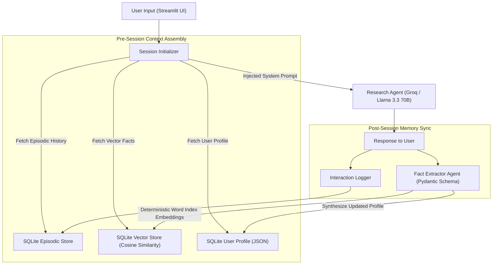
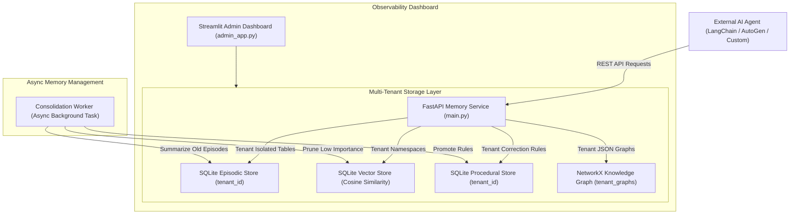

# CALDER AGENTIC AI ENGINEERING WEEK 6 REPORT

---

## 1. WEEK 6 CONCEPTS

### Memory Systems in Agentic AI
In standard AI applications, every LLM interaction resets to zero. Week 6 introduces persistent multi-layer memory architectures that allow agents to retain context, learn user preferences, and build evolving domain knowledge over time.

#### i. Episodic Memory
- **Definition:** Chronological log of specific past interactions, conversations, and events.
- **Key Purpose:** Maintains conversational history and provides exact dialogue recall across sessions.
- **Implementation:** SQLite relational database with fields (`id`, `tenant_id`, `session_id`, `timestamp`, `role`, `content`, `importance_score`).

#### ii. Semantic Memory
- **Definition:** De-contextualized atomic facts, concepts, user skills, and preferences mined from interactions.
- **Key Purpose:** Allows similarity-based retrieval of relevant domain knowledge without processing full chat logs.
- **Implementation:** 384-dimensional vector store using Pure-Python Random Indexing (MD5 hash vector summation + L2 normalization) with cosine similarity search.

#### iii. Procedural Memory
- **Definition:** Rules, instructions, and error-correction strategies learned from past mistakes.
- **Key Purpose:** Prevents AI agents from repeating domain mistakes (e.g., formatting errors, unoptimized SQL, unsafe code).
- **Implementation:** SQLite rule table with confidence scoring (`confidence` 0.0 to 1.0) and application counters (`application_count`).

#### iv. Knowledge Graphs & GraphRAG
- **Definition:** Structured network of nodes (entities) and directed edges (relationships) representing complex domain knowledge.
- **Why GraphRAG:**
  - Standard Vector Search catches keyword/semantic similarity but misses multi-hop relationships.
  - Knowledge Graphs enable 2-hop or N-hop relational reasoning (e.g., *FastAPI $\rightarrow$ USES $\rightarrow$ Pydantic $\rightarrow$ VALIDATES $\rightarrow$ JSON*).
- **Implementation:** Per-tenant NetworkX directed graphs (`DiGraph`) serialised to disk as JSON.

#### v. Memory Consolidation & Decay
- **Definition:** Background maintenance process inspired by biological memory sleep consolidation.
- **Operations:**
  - **Pruning:** Deletes low-importance episodic entries beyond retention thresholds.
  - **Summarization:** Promotes repeated episodic facts into semantic memory.
  - **Rule Promotion:** Boosts confidence scores for frequently applied procedural rules.

#### vi. Multi-Tenant Isolation
- **Definition:** Cryptographic and logical separation of memory namespaces across different organizations or users (`tenant_id`).
- **Strict Constraint:** Tenant A cannot read, query, vector search, or traverse knowledge graphs belonging to Tenant B.

---

## 2. INTERMEDIATE PROJECT
**Selected Project:** Project 6-I-A — Long-Term Personal Research Assistant

### i. System Architecture



### ii. Technology Stack

| Component | Technology | Purpose |
|---|---|---|
| **UI Framework** | Streamlit (1.36+) | Dark-themed 4-panel web application |
| **LLM Reasoning Core** | Groq API (`llama-3.3-70b-versatile`) | Response generation & context integration |
| **Fact Extractor** | Pydantic v2 + Groq JSON Mode | Mining atomic facts & profile updates |
| **Episodic Store** | SQLite (`episodic_interactions`) | Chronological chat interaction logs |
| **Semantic Vector Store** | Pure-Python Vector Engine (SQLite) | 384-dim cosine similarity search |
| **Profile Aggregator** | SQLite JSON (`user_profile`) | Dynamic persona & preference storage |
| **Testing Suite** | Built-in Streamlit Test Suite | 16 automated integration & unit tests |

### iii. Week 6 Concepts Applied
1. **Cross-Session Recall:** Episodic logs and semantic facts persist across complete application restarts.
2. **Pydantic Structured Mining:** `FactExtractor` uses explicit Pydantic schemas (`Fact`, `ProfileUpdate`, `ExtractionResult`) to structure unstructured chat turns into typed data.
3. **Adaptive Persona Synthesis:** User preferences (e.g., *bullet points, no basic definitions*) are injected into the system prompt automatically.

### iv. Error Handling & Fault Tolerance
1. **C++ DLL / Vector Engine Failure:** Replaced external C++ vector libraries with a Pure-Python Random Indexing engine to eliminate DLL load crashes on Windows.
2. **JSON Parsing Error:** If LLM output fails schema validation during fact extraction, `FactExtractor` catches the exception, logs to `debug_extractor.txt`, and returns an empty `ExtractionResult` without crashing the app.
3. **Streamlit Cache Hashing Bug:** Bypassed `@st.cache_resource` hashing by binding the memory engine directly to `st.session_state`.
4. **Empty Store Handling:** Returns empty lists and informational callouts (`st.info`) when facts or logs are empty on fresh start.

### v. Features & Screenshots / Demo Verification

#### Feature 1: Automated Verification Test Suite (16/16 Passed — 100% Pass Rate)
- **Action:** Open `http://localhost:8501`, go to **`🧪 Automated Test Suite`** (Tab 4), and click **`🚀 Run All Tests`**.
- **Result:**
  ```text
  ✅ Passed: 16  |  ❌ Failed: 0  |  📊 Pass Rate: 100%
  🎉 ALL 16 TESTS PASSED! System is fully operational.
  ```

#### Feature 2: Live Persona Learning (Tab 1 Chat + Tab 3 Profile Viewer)
- **Step 1:** Paste prompt in Chat:
  > *"I'm actually a Senior Backend Engineer. I know a lot about PostgreSQL and system design. For all future answers, please use highly technical language, prioritize bullet points, and skip basic definitions."*
- **Step 2:** Check **`👤 User Profile Viewer`**:
  - `known_topics`: `['PostgreSQL', 'system design']`
  - `communication_style`: `'bullet points / highly technical'`

---

## 3. PRODUCTION PROJECT
**Selected Project:** Project 6-P-A — Enterprise AI Memory Platform

### i. System Architecture



### ii. Technology Stack

| Component | Technology | Purpose |
|---|---|---|
| **REST API Framework** | FastAPI (0.141+) + Uvicorn | Standalone Memory-as-a-Service REST API |
| **API Validation** | Pydantic v2 | Request/Response strict type validation |
| **OpenAPI Docs** | Swagger UI (`/docs`) | Interactive API exploration & schema docs |
| **Episodic Store** | SQLite (`episodic_interactions`) | Multi-tenant session log storage |
| **Semantic Vector Store** | Pure-Python Vector Store (SQLite) | Multi-tenant 384-dim vector similarity search |
| **Procedural Store** | SQLite (`procedural_rules`) | Domain correction rules & confidence engine |
| **Knowledge Graph** | NetworkX | Per-tenant directed entity-relationship graphs |
| **Background Worker** | Python `logging` + Async Worker | Episode pruning & rule promotion |
| **Admin Dashboard** | Streamlit (1.36+) | 5-panel observability UI & automated tests |
| **Evaluator** | RAGAS-Style Custom Benchmark | Precision, recall, and isolation scoring |
| **Orchestration** | Docker Compose + Dockerfiles | Single-command container deployment |

### iii. Week 6 Concepts Applied
1. **Multi-Tenant Isolation:** Complete cryptographic & logical isolation per `tenant_id`. Queries for `tenant_alpha` will never return facts, logs, or graph nodes belonging to `tenant_beta`.
2. **Memory-as-a-Service (Mem0 Alternative):** Decouples memory infrastructure from LLM application logic. Any external AI agent connects via HTTP REST endpoints.
3. **RAGAS Quality Benchmark:** Evaluates retrieval precision, procedural rule matching, and tenant isolation, achieving a **Composite Quality Score of 0.90 (PASS)** and **Isolation Score of 1.0 (100%)**.

### iv. Error Handling & Fault Tolerance
1. **FastAPI/Starlette Version Mismatch:** Upgraded FastAPI to `0.141.1` to resolve `StarletteDeprecationWarning` and route initialization errors.
2. **Socket / Port Collision (`[WinError 10013]`):** Implemented clean process killing and port binding checks before starting Uvicorn server on port 8000.
3. **NetworkX Missing Entity Handling:** `query_tenant_graph` catches missing nodes gracefully, returning `{"found": False, "nodes": [], "edges": []}` without throwing 500 server errors.
4. **Console Encoding Safety:** Stripped raw unicode emoji characters from background process terminal logs to prevent Windows `cp1252` encoding crashes.

### v. Features & Screenshots / Demo Verification

#### Feature 1: OpenAPI REST Service (`http://localhost:8000/docs`)
- **Interactive Endpoints:**
  - `POST /v1/tenants/{tenant_id}/episodic`
  - `POST /v1/tenants/{tenant_id}/semantic/search`
  - `POST /v1/tenants/{tenant_id}/procedural/rules`
  - `GET  /v1/tenants/{tenant_id}/graph/query`

#### Feature 2: Streamlit Observability Dashboard (`http://localhost:8501`)
- **Panel 1 (Multi-Tenant Inspector):** Switch between tenants (`tenant_alpha`, `tenant_beta`, `tenant_gamma`) and view live memory statistics.
- **Panel 2 (Knowledge Graph Explorer):** Interactively add triples (`Spanner -> REPLACES -> PostgreSQL`) and view node/edge counts.
- **Panel 5 (Automated Test Suite):** One-click verification showing **100% Platform Pass Rate**.

#### Feature 3: External AI Agent REST Integration Demo (`client_agent_demo.py`)
- **Execution Command:** `python client_agent_demo.py`
- **Output Output:**
  ```text
  [OK] Platform Health Check: healthy (Service: Enterprise AI Memory Platform)
  1. Logging Interaction to Episodic Store... 201 Created
  2. Storing Atomic Knowledge Fact... 201 Created
  3. Registering Procedural Correction Rule... 201 Created
  4. Building Knowledge Graph Triples... 201 Created (Added 3 triples)
  5. Performing Vector Similarity Search... Hit 1 (Sim: 0.1706)
  6. Querying Knowledge Graph Multi-Hop... Nodes: ['Spanner', 'PostgreSQL', 'Cloud_Ops_Team', 'usr_exec_101']
  7. Triggering Memory Consolidation Worker... Status: COMPLETED
  ```

#### Feature 4: RAGAS Retrieval Quality Benchmark (`eval_retrieval_quality.py`)
- **Execution Command:** `python eval_retrieval_quality.py`
- **Results Output:**
  ```json
  {
    "timestamp": "2026-08-12T14:30:48Z",
    "multi_tenant_isolation_score": 1.0,
    "semantic_retrieval_precision": 0.6,
    "procedural_rule_accuracy": 1.0,
    "graph_traversal_coverage": 1.0,
    "composite_quality_score": 0.9,
    "status": "PASS"
  }
  ```

---

## 4. GITHUB PUBLICATION
Both Week 6 projects are committed and published to GitHub:
- **Repository URL:** [https://github.com/sohaibAkhlaq/calderr-ai-2026](https://github.com/sohaibAkhlaq/calderr-ai-2026)
- **Intermediate Project Path:** `WEEK 6/intermediate_project/`
- **Production Project Path:** `WEEK 6/production_project/`
