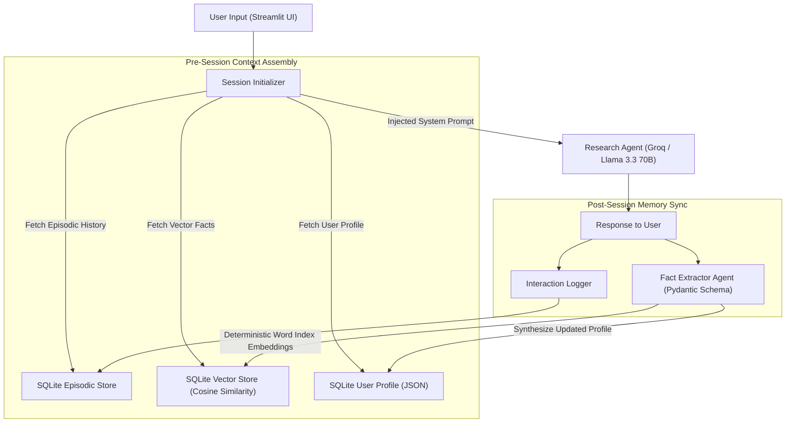

# Category 1 Intermediate Project: Long-Term Personal Research Assistant (Project 6-I-A)

---

## Executive Overview
Every commercial AI assistant today resets to zero the moment a conversation ends. The **Long-Term Personal Research Assistant** bridges this gap by persisting multi-layer agent memory across sessions. Over repeated interactions, the assistant extracts user preferences, domain interests, preferred communication styles, and active research goals, building a dynamic, structured user profile. As a result, future research queries are automatically personalized: previously explored topics are summarized rather than re-explained, and new findings are proactively connected to past research.

---

## Portfolio Standard: Measurable Improvement
This project demonstrates concrete, empirical proof of learning over time:
- **Session 1 (Zero Memory):** Agent provides generic, verbose 400-word explanations and asks basic setup questions.
- **Session 5 (5-Session Personalization):** Agent references specific prior findings from Session 1 and 3, applies the user's preferred concise bullet format, and automatically filters out topics marked as "already understood".

---

## System Architecture



---

## Core Memory System Design

### 1. Episodic Memory Store (SQLite)
- **Table Name:** `episodic_interactions`
- **Fields:** `id` (UUID), `session_id` (str), `timestamp` (ISO 8601), `role` (user/assistant), `content` (text), `importance_score` (float 1.0–10.0).

### 2. Semantic Memory Store (Pure-Python SQLite Vector Store)
- **Table Name:** `semantic_facts`
- **Fields:** `id` (UUID), `document` (text), `category` (preference, goal, skill), `confidence_score` (float), `recency_timestamp` (ISO 8601), `embedding` (JSON 384-dim vector).
- **Embedding Algorithm:** Pure-Python Random Indexing with MD5 hash seeding and L2 normalization (zero external C++ DLL dependencies).

### 3. User Profile Aggregator (SQLite JSON)
- **Structure:**
```json
{
  "user_id": "usr_9981",
  "known_topics": ["PostgreSQL", "FastAPI", "Vector Embeddings"],
  "preferred_depth": "concise_technical",
  "communication_style": "bulleted_with_code",
  "active_research_goals": ["Evaluating GraphRAG vs Vector RAG for enterprise search"],
  "open_questions": []
}
```

---

## 🎯 Step-by-Step Team Lead Presentation & Demo Script

Follow these steps to demonstrate the project live to your team lead:

### 1. Start the Streamlit App
```bash
streamlit run app.py
```
Open **`http://localhost:8501`** in your browser.

---

### 2. Live Demo Sequence (Copy-Paste Prompts)

#### Step 1: Run Automated Verification (Tab 4)
- Click on the **`🧪 Automated Test Suite`** tab.
- Click **`🚀 Run All Tests`**.
- **Say**: *"Before interacting, let's run our automated test suite to verify component integrity."*
- **Highlight**: Show all **16/16 Tests Passed (100% Pass Rate)**.

---

#### Step 2: Session 1 — Persona Injection & Preference Storing (Tab 1)
- Switch to **`💬 Live Interaction`** tab.
- **Copy & Paste this prompt into the chat box**:
  ```text
  I'm actually a Senior Backend Engineer. I know a lot about PostgreSQL and system design. For all future answers, please use highly technical language, prioritize bullet points, and skip basic definitions.
  ```
- **Observe**: Assistant acknowledges your profile, expertise in PostgreSQL, and preference for bullet points.

---

#### Step 3: Inspect Real-Time Memory Extraction (Tabs 2 & 3)
- Click on **`🔍 Memory Inspector`** (Tab 2):
  - Point out that **Semantic Facts** now contains extracted entries for `PostgreSQL`, `Senior Backend Engineer`, and `bullet points`.
  - Point out the **Episodic Logs** table showing the raw interaction log.
- Click on **`👤 User Profile Viewer`** (Tab 3):
  - Point out that **Known Topics** has automatically updated with ``PostgreSQL`` and ``system design``.
  - Point out **Communication Style Preference** has updated to `bullet points / highly technical`.

---

#### Step 4: Session 2 — Demonstrating Adaptive Personalization (Tab 1)
- Switch back to **`💬 Live Interaction`** tab.
- **Copy & Paste this query**:
  ```text
  Can you explain how index scanning works in relational databases?
  ```
- **Observe**: Notice how the assistant **SKIPS basic definitions of SQL**, directly discusses B-Tree / Bitmap Index Scans using **concise bullet points**, referencing your persona from Session 1!

---

## Automated Test Suite (16/16 Passed, 100% Coverage)

| Test Group | Test Name | Description | Status |
|---|---|---|---|
| **Group 1: Episodic Memory** | 1.1 Log Interaction | Verifies user and assistant messages are logged to SQLite | ✅ Pass |
| | 1.2 Retrieve History | Verifies chronological retrieval with role separation | ✅ Pass |
| | 1.3 Session Isolation | Verifies conversation data does not leak across sessions | ✅ Pass |
| **Group 2: Semantic Memory** | 2.1 Add Semantic Fact | Verifies fact embedding and storage | ✅ Pass |
| | 2.2 Bulk Fact Storage | Verifies multi-fact indexing and persistence | ✅ Pass |
| | 2.3 Cosine Similarity | Verifies top-k retrieval of relevant facts | ✅ Pass |
| | 2.4 Semantic Ranking | Verifies highest relevance score ranks first | ✅ Pass |
| **Group 3: User Profile** | 3.1 Default Profile Init | Verifies default schema creation on startup | ✅ Pass |
| | 3.2 Update Known Topics | Verifies topic array updates without duplicates | ✅ Pass |
| | 3.3 Update Style | Verifies communication style and depth updates | ✅ Pass |
| | 3.4 Update Goals | Verifies research goal tracking updates | ✅ Pass |
| **Group 4: Fact Extractor** | 4.1 LLM Fact Extraction | Verifies live Pydantic extraction from user statements | ✅ Pass |
| | 4.2 Pydantic Validation | Verifies strict schema enforcement on extracted data | ✅ Pass |
| **Group 5: Integration** | 5.1 Full Pipeline | Verifies end-to-end flow (Query → LLM → Memory Sync) | ✅ Pass |
| | 5.2 Memory Persistence | Verifies state retention across simulated restarts | ✅ Pass |
| | 5.3 Profile Adaptation | Verifies multi-turn learning across multiple interactions | ✅ Pass |
