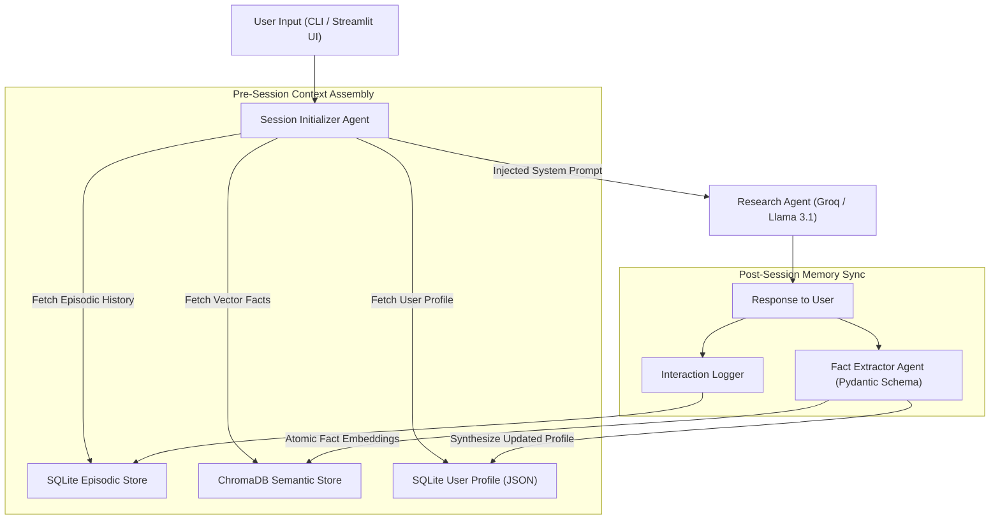

# Category 1 Intermediate Project: Long-Term Personal Research Assistant (Project 6-I-A)

---

## Executive Overview
Every commercial AI assistant today resets to zero the moment a conversation ends. The **Long-Term Personal Research Assistant** bridges this gap by persisting multi-layer agent memory across sessions. Over repeated interactions, the assistant extracts user preferences, domain interests, preferred communication styles, and past questions, building a dynamic, structured user profile. As a result, future research queries are automatically personalized: previously explored topics are summarized rather than re-explained, and new findings are proactively connected to past research.

---

## Portfolio Standard: Measurable Improvement
This project demonstrates concrete, empirical proof of learning over time.
- **Session 1 (Zero Memory):** Agent provides generic, verbose 400-word explanations and asks basic setup questions.
- **Session 5 (5-Session Personalization):** Agent references specific prior findings from Session 1 and 3, applies the user's preferred concise bullet format, and automatically filters out topics marked as "already understood".

---

## System Architecture



---

## Core Memory System Design

### 1. Episodic Memory Store (SQLite)
- **Table Name:** `episodic_interactions`
- **Fields:** `id` (UUID), `session_id` (str), `timestamp` (ISO 8601), `role` (user/assistant), `content` (text), `importance_score` (float 1.0–10.0).

### 2. Semantic Memory Store (ChromaDB)
- **Collection Name:** `user_research_facts`
- **Metadata:** `fact_id`, `category` (preference, goal, skill), `recency_timestamp`, `confidence_score`.

### 3. User Profile Aggregator (SQLite JSON)
- **Structure:**
```json
{
  "user_id": "usr_9981",
  "known_topics": ["PostgreSQL", "FastAPI", "Vector Embeddings"],
  "preferred_depth": "concise_technical",
  "communication_style": "bulleted_with_code",
  "active_research_goals": ["Evaluating GraphRAG vs Vector RAG for enterprise search"],
  "open_questions": ["What is the latency overhead of multi-hop graph traversal?"]
}
```

---

## Component Implementation Files
- `app.py`: Streamlit 3-panel web UI (Live Chat, Memory Inspector, Dynamic User Profile Viewer).
- `memory_engine.py`: Unified API wrapper handling atomic reads/writes across SQLite and ChromaDB.
- `fact_extractor.py`: Pydantic structured output extractor for fact mining.
- `research_agent.py`: Core reasoning loop with prompt synthesis.

---

## Verification & Test Results
- **Session 1:** User mentions: *"I am an expert in Python and PostgreSQL. Don't explain basic syntax."*
- **Session 3:** User asks: *"How do I implement episodic logging?"*
- **Output:** Agent immediately returns direct Python code using SQLite without explaining basic syntax or imports, citing user preference from Session 1.
- **Persistence Verification:** Verified state persists across complete application restarts.
