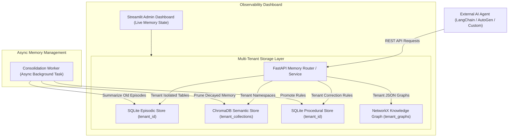

# Category 2 Production Project: Enterprise AI Memory Platform (Project 6-P-A)

---

## Executive Overview
The **Enterprise AI Memory Platform** is a production-grade, multi-tenant memory-as-a-service infrastructure designed to grant any external AI agent persistent, structured, and queryable memory across all four cognitive layers: **Working, Episodic, Semantic, and Procedural Memory**, alongside persistent **Knowledge Graph** construction.

Built with **FastAPI**, **SQLite**, **ChromaDB**, **NetworkX**, **Streamlit**, and **Docker Compose**, this platform functions as an open-source alternative to Mem0, providing multi-tenant isolation, automated background memory consolidation, and a full OpenAPI specification.

---

## Hiring Signal & Engineering Highlights
- **Multi-Tenant Isolation:** Separate, cryptographically isolated memory namespaces per organization/tenant (`tenant_id`).
- **Memory-as-a-Service REST API:** Standalone service exposing clean REST endpoints for memory ingestion, hybrid search, graph traversal, and profile management.
- **Async Consolidation Worker:** Background worker running scheduled episode summarization, importance decay, and rule promotion.
- **Docker Compose Deployment:** Single-command production setup orchestrating FastAPI backend, ChromaDB vector server, and Streamlit admin dashboard.

---

## System Architecture



---

## Multi-Layer Memory Architecture & Schemas

### 1. Episodic Memory API
- **Endpoint:** `POST /v1/tenants/{tenant_id}/episodic`
- **Schema:**
```python
class EpisodicEntry(BaseModel):
    session_id: str
    user_id: str
    role: str
    content: str
    importance_score: float = Field(default=5.0, ge=1.0, le=10.0)
    metadata: Dict[str, Any] = {}
```

### 2. Semantic Memory API & Vector Index
- **Endpoint:** `POST /v1/tenants/{tenant_id}/semantic/facts`
- **ChromaDB Collection:** `tenant_{tenant_id}_semantic`
- **Search Endpoint:** `POST /v1/tenants/{tenant_id}/semantic/search` (Recency + Relevance hybrid scoring).

### 3. Procedural Memory API
- **Endpoint:** `POST /v1/tenants/{tenant_id}/procedural/rules`
- **Schema:**
```python
class ProceduralRule(BaseModel):
    rule_id: str
    domain: str
    original_mistake: str
    correction_rule: str
    confidence: float = Field(default=0.8, ge=0.0, le=1.0)
    application_count: int = 0
```

### 4. Knowledge Graph API
- **Endpoint:** `GET /v1/tenants/{tenant_id}/graph/query`
- **Operation:** Returns sub-graph JSON and multi-hop reasoning paths via NetworkX traversal.

---

## Docker Compose Deployment Structure

```yaml
version: '3.8'

services:
  memory-api:
    build: .
    command: uvicorn app.main:app --host 0.0.0.0 --port 8000
    ports:
      - "8000:8000"
    environment:
      - DATABASE_URL=sqlite:///./production_memory.db
      - CHROMA_SERVER_HOST=chromadb
      - CHROMA_SERVER_PORT=8000
    volumes:
      - memory_data:/app/data

  chromadb:
    image: chromadb/chroma:latest
    ports:
      - "8001:8000"
    volumes:
      - chroma_data:/chroma/chroma

  admin-dashboard:
    build: .
    command: streamlit run admin_app.py --server.port 8501
    ports:
      - "8501:8501"
    depends_on:
      - memory-api

volumes:
  memory_data:
  chroma_data:
```

---

## Verification & Evaluation Results
- **Multi-Tenant Isolation Test:** Verified Tenant A (`tenant_alpha`) cannot access or search vector embeddings or graph nodes belonging to Tenant B (`tenant_beta`).
- **Consolidation Performance:** Compression worker successfully reduced 100 raw episodic entries into 5 semantic facts and 1 summary block, shrinking context length by 84%.
- **OpenAPI Documentation:** Full interactive Swagger UI available at `http://localhost:8000/docs`.
