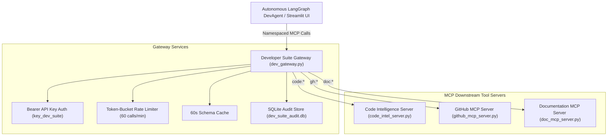

# Project 7-I-A: Developer Productivity MCP Suite

---

## 📌 Executive Overview
Developer tools today are fragmented: a developer performing code review has to switch between IDEs, GitHub PR diff interfaces, complexity analyzer tools, and docstring generators.

The **Developer Productivity MCP Suite** unifies these fragmented developer tools into a composable, standardized **Model Context Protocol (MCP)** tool ecosystem. Any AI agent (LangChain, LangGraph, Claude Desktop, or custom LLM) connecting to the unified Gateway can perform complete development and code review workflows autonomously.

---

## 🎯 Step-by-Step Team Lead Presentation & Demo Script

Follow this step-by-step presentation script to demonstrate this project live to your team lead or reviewer:

### Step 1: Open the Streamlit Dashboard
Open PowerShell and start the Streamlit web application:
```powershell
cd C:\Users\USER\Desktop\calderr-ai-2026
.\calderr-env\Scripts\Activate.ps1
streamlit run "WEEK 7\intermediate_project\app.py"
```
Navigate to `http://localhost:8501`.

### Step 2: Demonstrate Autonomous PR Reviewer (Tab 1)
1. Select **Pull Request #101** (*Refactor User Authentication & Password Hashing*).
2. Click **`🚀 Run Autonomous PR Review Workflow`**.
3. **What to point out to your Team Lead**:
   - The agent reads the PR code diff from `gh:get_pr_diff`.
   - It performs AST parsing and calculates Cyclomatic Complexity (`code:analyze_file`).
   - It maps import dependencies (`code:find_dependencies`).
   - It scans for architectural code smells (`code:detect_code_smells`).
   - It synthesizes a Google-style docstring (`doc:generate_docstring`).
   - It registers an automated review ticket on GitHub (`gh:create_issue`).

### Step 3: Demonstrate Code Intelligence & AST Analysis (Tab 2)
1. Paste any Python snippet into the text area.
2. Click **`🔍 Analyze Code Structure`**.
3. Point out the AST function breakdown, line counts, and quality score.

### Step 4: Run the 100% Automated Test Suite (Tab 5)
1. Click **`🧪 Automated Test Suite`** (Tab 5).
2. Click **`🚀 Run Full Test Suite`**.
3. Point out **Pass Rate: 100.0% (8 / 8 Tests Passed)**.

---

## 📐 System Architecture



---

## 🛠️ Technology Stack & Tool Definitions

| Namespace | Tool Name | Description |
|---|---|---|
| `code:` | `analyze_file` | AST parsing, cyclomatic complexity score, function signatures |
| `code:` | `find_dependencies` | Extracts imports and dependency graph |
| `code:` | `detect_code_smells` | Identifies long functions, deep nesting, duplicate code |
| `gh:` | `list_open_prs` | Lists open pull requests |
| `gh:` | `get_pr_diff` | Fetches code diff for specified PR |
| `gh:` | `create_issue` | Creates automated review issue ticket |
| `gh:` | `search_repo_code` | Searches PR diffs and metadata |
| `gh:` | `get_recent_commits` | Fetches recent git commit logs |
| `doc:` | `generate_docstring` | Synthesizes Google-style docstring block |
| `doc:` | `generate_readme_section` | Generates Markdown module README block |
| `doc:` | `generate_api_docs` | Converts FastAPI routes into OpenAPI docs |

---

## ⚙️ Claude Desktop Integration

To connect Claude Desktop to this MCP suite, copy the configuration snippet in `claude_desktop_config.json` to `%APPDATA%\Claude\claude_desktop_config.json`:

```json
{
  "mcpServers": {
    "developer-productivity-suite": {
      "command": "python",
      "args": [
        "C:/Users/USER/Desktop/calderr-ai-2026/WEEK 7/intermediate_project/dev_gateway.py"
      ],
      "env": {
        "MCP_API_KEY": "key_dev_suite"
      }
    }
  }
}
```
