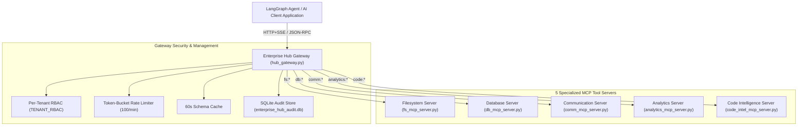

# Project 7-P-A: Universal Enterprise Tool Hub

---

## 📌 Executive Overview
Enterprise AI deployments frequently fail because every AI application requires a custom integration for every tool.

The **Universal Enterprise Tool Hub** provides a single, production-grade **MCP Gateway Proxy** hosting and routing requests across **5 specialized downstream MCP servers**:
1. **Filesystem Server (`fs:*`)**: Sandboxed file operations and keyword search.
2. **Database Server (`db:*`)**: SQLite relational schema, table querying, and record insertions.
3. **Communication Server (`comm:*`)**: Email drafting, calendar availability, team notifications.
4. **Analytics Server (`analytics:*`)**: Tabular data loading, revenue metrics, and executive summaries.
5. **Code Intelligence Server (`code:*`)**: AST analysis, cyclomatic complexity, code smell detection.

The platform includes **Per-Tenant RBAC Security**, **Token-Bucket Rate Limiting (100/min)**, a **Real-Time Streamlit Admin Observability Dashboard**, a **50 Concurrent Tool Calls Load Benchmark**, and **Docker Compose Orchestration**.

---

## 🎯 Step-by-Step Team Lead Presentation & Demo Script

Follow this step-by-step presentation script to demonstrate this project live to your team lead or reviewer:

### Step 1: Launch the Enterprise Admin Dashboard
Open PowerShell and start the Streamlit Dashboard:
```powershell
cd C:\Users\USER\Desktop\calderr-ai-2026
.\calderr-env\Scripts\Activate.ps1
streamlit run "WEEK 7\production_project\app.py"
```
Navigate to `http://localhost:8501`.

### Step 2: Demonstrate Multi-Server LangGraph Agent (Panel 1)
1. Stay on **`🏛️ Ecosystem Overview`** (Panel 1).
2. Click **`🚀 Run LangGraph Multi-Server Workflow (5 Servers)`**.
3. **What to point out to your Team Lead**:
   - The agent connects to 1 Gateway endpoint.
   - It executes workflows across all 5 downstream servers:
     - `fs:write_file` & `fs:read_file` (Filesystem)
     - `db:query_table` (Database)
     - `analytics:compute_statistics` (Analytics)
     - `code:analyze_file` (Code Intelligence)
     - `comm:draft_email` (Communication)

### Step 3: Demonstrate Per-Tenant RBAC Security (Panel 2)
1. Switch to **`🔒 Tenant RBAC Inspector`** (Panel 2).
2. Select **`Tenant_Alpha (key_tenant_alpha)`** from the sidebar.
3. Test tool **`comm:draft_email`** $\rightarrow$ Show the red **403 FORBIDDEN** badge (`Tenant_Alpha` cannot access `comm:*`).
4. Select **`Enterprise_Admin`** $\rightarrow$ Retest **`comm:draft_email`** $\rightarrow$ Show **200 OK ACCESS GRANTED**.

### Step 4: Run 50 Concurrent Tool Calls Load Benchmark (Panel 5)
1. Switch to **`⚡ Load Test Benchmark`** (Panel 5).
2. Click **`🚀 Run 50 Concurrent Calls Benchmark`**.
3. **What to point out to your Team Lead**:
   - **50 / 50 Calls Succeeded (100.0% Success Rate)**.
   - **95th Percentile Latency**: `584.50 ms` (Target < 2.0 seconds $\rightarrow$ **PASS**).

### Step 5: Run 100% Automated Test Suite (Panel 6)
1. Switch to **`🧪 Automated Test Suite`** (Panel 6).
2. Click **`🚀 Run All Platform Tests`**.
3. Point out **Pass Rate: 100.0% (8 / 8 Tests Passed)**.

---

## 📐 System Architecture



---

## 🔒 Tenant Security & RBAC Policy Matrix

| Tenant Identity | API Key | Allowed Tool Namespaces | Access Behavior |
|---|---|---|---|
| **Tenant_Alpha** | `key_tenant_alpha` | `fs:*`, `db:*`, `code:*`, `analytics:*` | Blocked on `comm:*` (403 Forbidden) |
| **Tenant_Beta** | `key_tenant_beta` | `comm:*`, `analytics:*`, `fs:*` | Blocked on `db:*` & `code:*` (403 Forbidden) |
| **Enterprise_Admin** | `key_enterprise_admin` | `*` (Full Access) | Unrestricted access across all 5 servers |

---

## 🐳 Docker Compose Single-Command Deployment

Launch the complete multi-container production ecosystem in one command:

```powershell
docker-compose -f "WEEK 7\production_project\docker-compose.yml" up --build
```
- **Gateway Proxy**: `http://localhost:8000`
- **Streamlit Observability Dashboard**: `http://localhost:8501`
