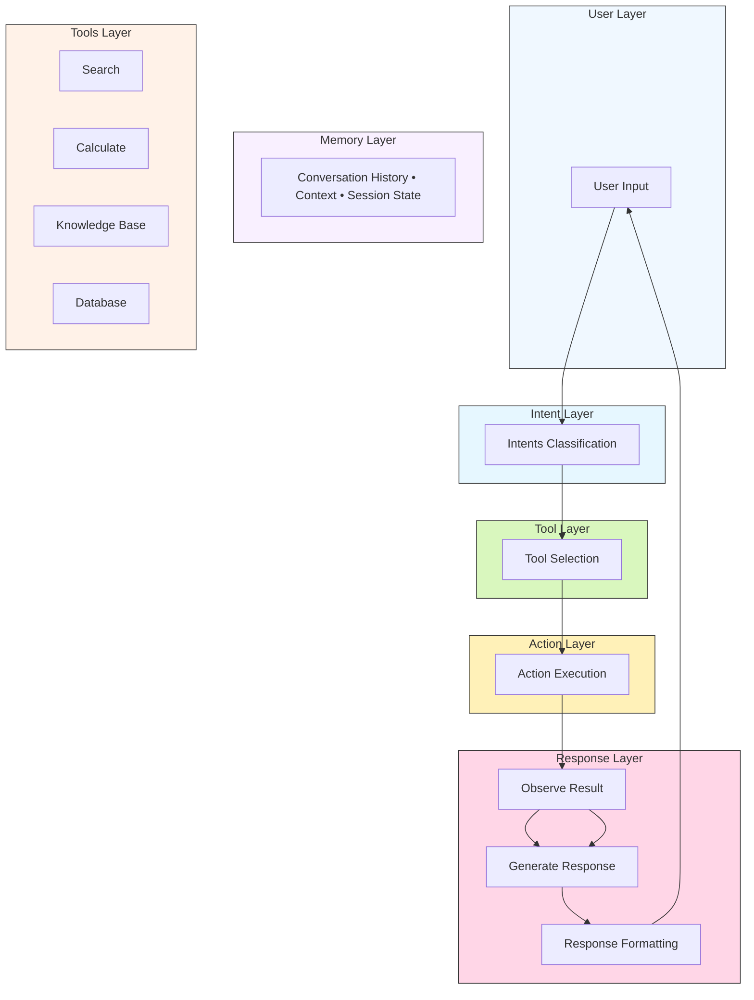
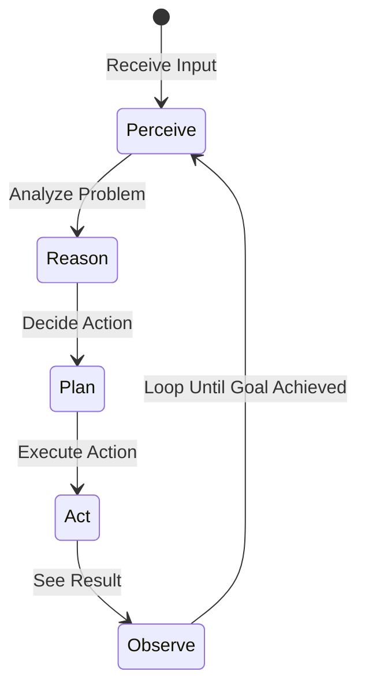

# Week 1 – Architecture Diagram
This document provides a comprehensive overview of the chatbot architecture, agent loop, LangChain chain patterns, technology stack, and data flow, presented with clear diagrams and structured tables for easy reference.
## Chatbot Architecture



**Explanation** – The diagram illustrates the forward flow of a user request through intent classification, tool selection, action execution, result observation and response generation. The memory layer stores conversational context, while the tools layer provides auxiliary capabilities such as search, calculation, knowledge‑base lookup and database access.

---

## Agent Loop



---

## LangChain Chain Patterns

### Pattern 1: Simple Chain
```
prompt | llm | parser
```

### Pattern 2: RunnablePassthrough
```
{ "context": retriever, "question": RunnablePassthrough() } | prompt | llm | parser
```

### Pattern 3: RunnableParallel
```
RunnableParallel({ "a": chain1, "b": chain2 })
```

---

## Technology Stack

| Layer          | Technology                              |
|----------------|------------------------------------------|
| **LLM**       | Groq (llama‑3.3‑70b, llama‑3.1‑8b)      |
| **Framework** | LangChain LCEL                           |
| **Memory**    | In‑memory conversation buffer            |
| **Retrieval** | BM25 (keyword‑based)                    |
| **UI**        | Rich (terminal)                         |
| **Environment**| Python 3.11.9                           |

---

## Data Flow
1. **User Input** → 2. **Intent Classification** → 3. **Tool Selection** → 4. **Action Execution** → 5. **Result Observation** → 6. **Response Generation** → 7. **User Output**

---

*Document generated on 2026‑06‑28.*
